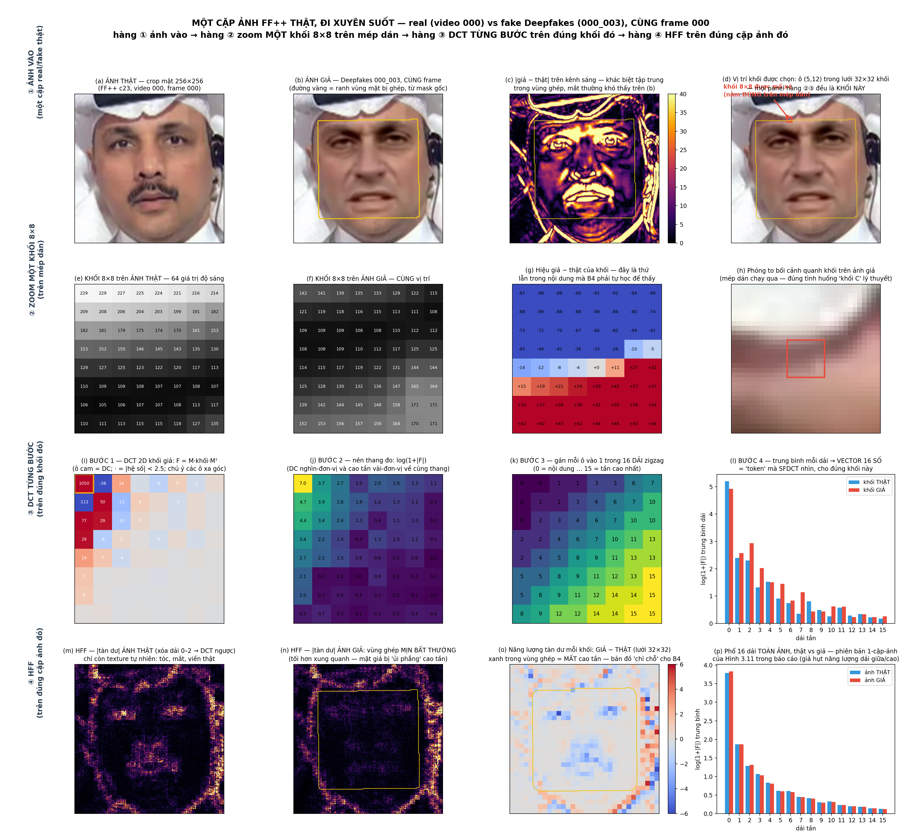
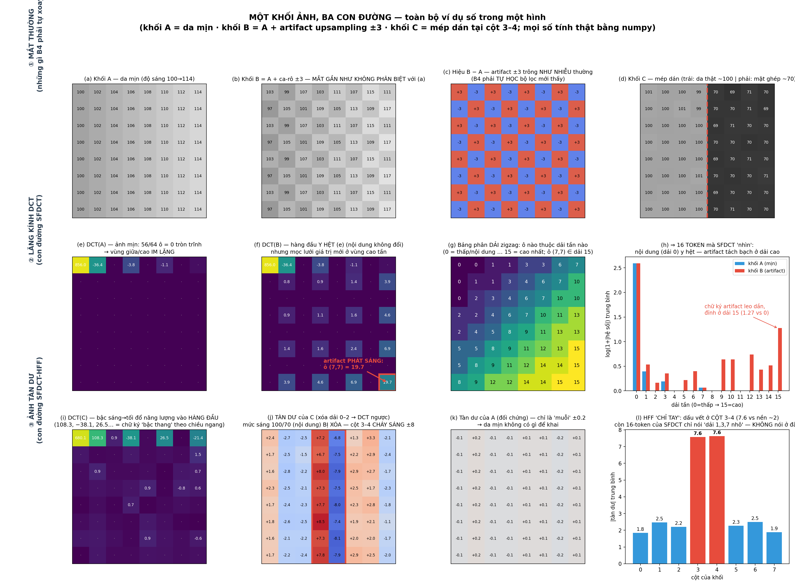
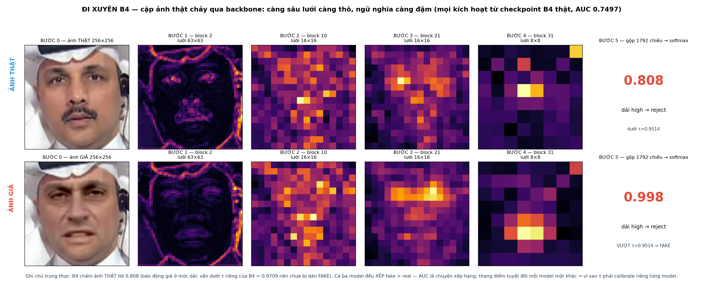
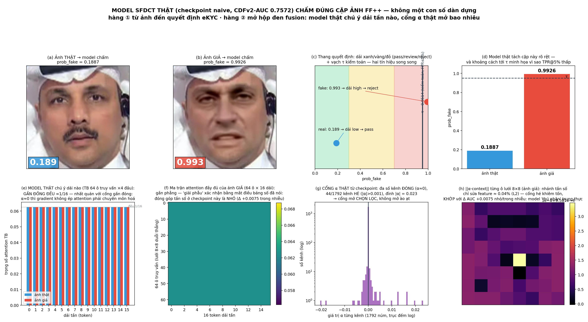
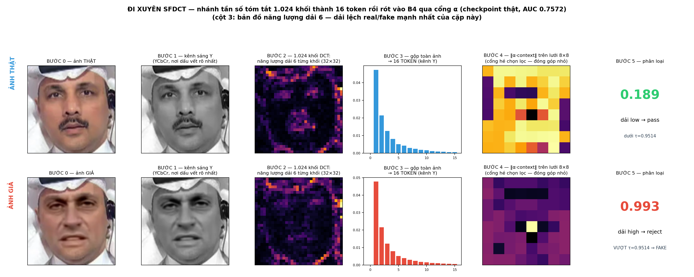
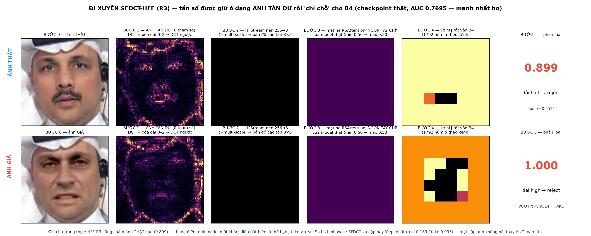
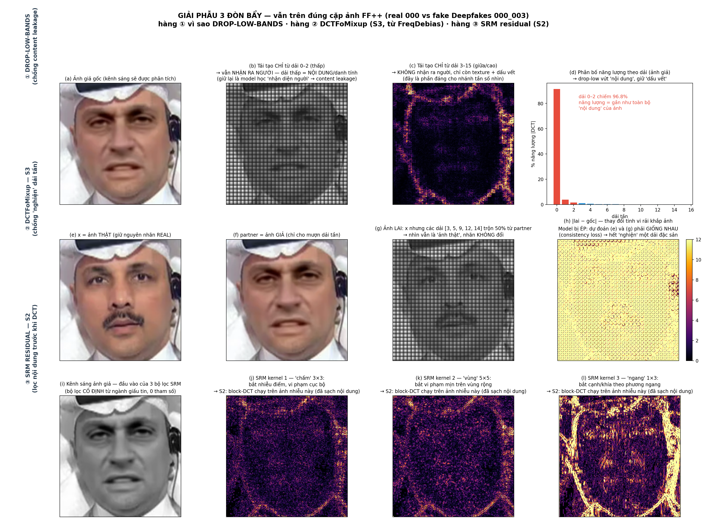
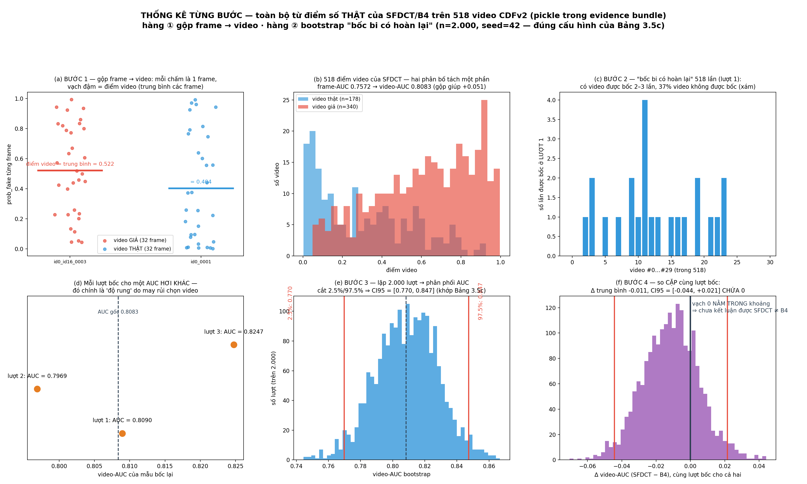

# Giải thích kiến trúc B4 → SFDCT → SFDCT-HFF — hiểu bằng ví dụ số đầy đủ

> **Cách dùng:** Phần A đọc 5 phút. Phần B là trái tim tài liệu — **một ví dụ chạy xuyên suốt**: ba khối ảnh
> 8×8 cụ thể được đưa qua cả ba kiến trúc, **in đầy đủ mọi ma trận** ở từng bước, kèm hai màn "đặt cạnh nhau"
> (B4 ↔ SFDCT, SFDCT ↔ HFF) trên cùng dữ liệu. Phần C: kiến trúc đầy đủ cấp hệ thống. Phần D: cách đo.
> Phần E: bảng tổng + vũ khí bảo vệ. Phụ lục: script numpy ~25 dòng tái lập mọi con số trong tài liệu.
> Mọi ma trận đều **tính thật** (không vẽ tay); mọi số hiệu năng khớp `THESIS_REPORT_EN.md`.

---

# PHẦN A — Hiểu trong 5 phút

**Bài toán:** cho ảnh khuôn mặt → thật hay giả (deepfake)? Cái khó số 1: **gặp kiểu giả CHƯA TỪNG THẤY lúc train vẫn phải nhận ra** (*cross-dataset generalization* — train trên FaceForensics++, chấm trên Celeb-DF-v2 do pipeline hoàn toàn khác sinh ra). Thước đo: **AUC** (*xác suất model xếp 1 ảnh giả "đáng ngờ hơn" 1 ảnh thật bất kỳ; 1.0 = hoàn hảo, 0.5 = tung xu*).

**Ý tưởng xuyên suốt:** mọi công cụ deepfake đều phải **upsampling** (phóng to ảnh — để lại hoa văn lưới chu kỳ) và **blending** (dán mặt vào khung — làm mịn bất thường quanh mép). Hai dấu vết này mắt thường gần như không thấy, nhưng **lộ ra trong miền tần số** (phân tích ảnh thành thành phần dao động thô→mịn, như tách bản nhạc thành nốt trầm/cao).

| Nấc | Ẩn dụ | Một câu |
|---|---|---|
| **B4** | Đôi mắt tinh tường | CNN mạnh nhìn ảnh như chuyên gia — mốc chuẩn mọi cải tiến phải vượt |
| **SFDCT** | + Tai nghe tần số, báo cáo bằng **bảng thống kê** | Thêm nhánh DCT khối 8×8, nối qua cổng **α khởi tạo 0** ⇒ tệ nhất cũng = B4 |
| **SFDCT-HFF** | + Máy soi in hẳn **ảnh vùng nghi vấn** và chỉ tay | Không thống kê nữa — xóa "nội dung", dựng lại **ảnh tàn dư cao tần** còn nguyên VỊ TRÍ, dùng nó chỉ chỗ cho B4 |

| Model | Frame-AUC CDFv2 | Đọc thế nào |
|---|---|---|
| B4 | 0.7497 | Khớp leaderboard 0.7487 ⇒ pipeline dựng đúng |
| SFDCT | 0.7572 (+0.0075) | Đúng hướng, **trong nhiễu** (1 seed, CI chứa 0) |
| SFDCT-HFF R3 | **0.7695** | Cao nhất họ; video-AUC 0.8269; CI vẫn chứa 0; **không claim SOTA** (SPSL 0.7650) |

---

# PHẦN B — MỘT KHỐI ẢNH, BA CON ĐƯỜNG (ví dụ số đầy đủ)

> 🖼 **Hình chính — MỘT CẶP ẢNH FF++ THẬT đi xuyên suốt cả 4 hàng** (real video 000 vs fake Deepfakes 000_003, CÙNG frame; đường vàng = ranh vùng ghép lấy từ mask gốc của FF++). Nguyên tắc: *mọi hàng cùng một đầu vào* — hàng ① ảnh vào, hàng ② zoom đúng MỘT khối 8×8 nằm trên mép dán, hàng ③ DCT **từng bước** trên đúng khối đó, hàng ④ HFF trên đúng cặp ảnh đó:



*Hình B.0a: Cặp real/fake thật từ FF++ qua 4 hàng cùng-đầu-vào. Hai phát hiện đọc được ngay từ hình: (l) vector 16 dải của khối GIẢ thấp hơn khối THẬT ở dải giữa/cao — mặt ghép bị "ủi phẳng" cao tần; (o) bản đồ năng-lượng-tàn-dư GIẢ−THẬT âm (xanh) đúng bên trong vùng ghép — chính là tín hiệu "chỉ chỗ" mà HFF đưa cho B4. Sinh lại 1 lệnh: `python3 report_prepare/mt16_explain_real_ffpp.py`.*

> 🧪 **Hình phụ — phiên bản "phòng thí nghiệm"** với 3 khối nhân tạo (để thấy cơ chế ở dạng tinh khiết nhất, không nhiễu):



*Hình B.0b: Ba khối nhân tạo A/B/C. Lưu ý: hàng ② dùng cặp A–B (artifact), hàng ③ dùng khối C (mép dán) — mỗi hàng minh họa một LOẠI dấu vết ở dạng tinh khiết; còn phiên bản cùng-một-đầu-vào trọn vẹn là Hình B.0a ở trên. Sinh lại: `python3 report_prepare/mt15_explain_visual.py`.*

## B.0 Ba nhân vật chính

Toàn bộ phần B dùng đúng **ba khối 8×8 điểm ảnh** này (giá trị = độ sáng, 0 đen – 255 trắng). Chúng mô phỏng ba tình huống thật trên một khuôn mặt:

**Khối A — "da mịn"** (vùng má thật: độ sáng tăng đều trái→phải, như má bắt sáng tự nhiên):

| 100 | 102 | 104 | 106 | 108 | 110 | 112 | 114 |
|---|---|---|---|---|---|---|---|
| 100 | 102 | 104 | 106 | 108 | 110 | 112 | 114 |
| 100 | 102 | 104 | 106 | 108 | 110 | 112 | 114 |
| 100 | 102 | 104 | 106 | 108 | 110 | 112 | 114 |
| 100 | 102 | 104 | 106 | 108 | 110 | 112 | 114 |
| 100 | 102 | 104 | 106 | 108 | 110 | 112 | 114 |
| 100 | 102 | 104 | 106 | 108 | 110 | 112 | 114 |
| 100 | 102 | 104 | 106 | 108 | 110 | 112 | 114 |

**Khối B — "da mịn + artifact upsampling"** = A cộng hoa văn ca-rô ±3 (dấu vết điển hình của generator phóng to ảnh):

| 103 | 99 | 107 | 103 | 111 | 107 | 115 | 111 |
|---|---|---|---|---|---|---|---|
| 97 | 105 | 101 | 109 | 105 | 113 | 109 | 117 |
| 103 | 99 | 107 | 103 | 111 | 107 | 115 | 111 |
| 97 | 105 | 101 | 109 | 105 | 113 | 109 | 117 |
| 103 | 99 | 107 | 103 | 111 | 107 | 115 | 111 |
| 97 | 105 | 101 | 109 | 105 | 113 | 109 | 117 |
| 103 | 99 | 107 | 103 | 111 | 107 | 115 | 111 |
| 97 | 105 | 101 | 109 | 105 | 113 | 109 | 117 |

**Khối C — "mép dán"** (4 cột trái là da thật ~100, 4 cột phải là mặt ghép tối hơn ~70; ranh giới nằm giữa cột 3 và 4; có nhiễu sensor ±0.5):

| 101 | 100 | 100 | 99 | 70 | 69 | 71 | 70 |
|---|---|---|---|---|---|---|---|
| 100 | 100 | 101 | 99 | 70 | 70 | 71 | 69 |
| 100 | 100 | 100 | 100 | 69 | 71 | 70 | 70 |
| 100 | 100 | 100 | 100 | 70 | 70 | 70 | 70 |
| 100 | 100 | 100 | 100 | 69 | 70 | 71 | 70 |
| 100 | 100 | 100 | 101 | 70 | 70 | 70 | 71 |
| 100 | 100 | 100 | 100 | 69 | 70 | 70 | 70 |
| 100 | 100 | 100 | 100 | 70 | 71 | 70 | 70 |

> 👁 **Bài kiểm tra mắt thường:** che bảng tiêu đề đi và nhìn A với B — các giá trị chỉ lệch ±3 trên nền ~100 (≈3%), in ra ảnh thật thì **hai khối gần như y hệt nhau**. Khối C thì mắt thấy được ranh sáng/tối, nhưng trên ảnh thật mép dán đã bị làm mờ (feathering) nên cũng rất khó. Ba con đường dưới đây là ba cách "nhìn" khác nhau vào đúng ba khối này.

## B.1 Con đường 1 — B4 nhìn ba khối này như thế nào?

B4 là CNN: nó nhìn **thẳng vào bảng điểm ảnh** và phải tự học các bộ lọc để phát hiện bất thường.

**Nó thấy gì ở khối B?** Lấy hiệu từng ô: B − A = ma trận toàn ±3 xen kẽ — với một bộ lọc chưa được học, thứ này **không phân biệt được với nhiễu sensor thông thường** (cũng là các dao động nhỏ quanh 0). B4 *có thể* học được một bộ lọc bắt hoa văn ca-rô — nhưng phải tự mò ra nó từ dữ liệu, qua hàng triệu tham số, và bộ lọc học được thường **bám theo tần số cụ thể của tập train** (ca-rô chu kỳ 2px của FF++); sang CDFv2 hoa văn đổi chu kỳ là hụt. Đây chính là cơ chế của "học vẹt dấu vết" (overfit artifact).

**Dòng chảy dữ liệu của B4 trên CẢ ảnh** (khối A/B/C chỉ là 3 trong số hàng nghìn khối của một ảnh):

```
[3, 256, 256] ──► 32 khối MBConv (7 tầng) ──► bản đồ đặc trưng [1792, 8, 8]
                                              (lưới 8×8 ô; mỗi ô = vector 1792 chiều
                                               mô tả một VÙNG ~32×32 px)
              ──► gộp trung bình ──► vector 1792 chiều ──► logits [thật, giả] ──► softmax
```

Bên trong mỗi khối MBConv: phình kênh 1×1 (×6) → tích chập theo từng kênh → **SE** (chú ý kênh) → nén 1×1 + residual.

> 📐 **Ví dụ số — SE attention:** 4 kênh sau gộp trung bình = [viền-sắc 0.80, nhiễu-nền 0.10, kết-cấu-da 0.50, bóng-đổ 0.05]; mạng SE chấm điểm [0.9, 0.2, 0.7, 0.1]; nhân lại → [**0.72**, **0.02**, 0.35, 0.005] — kênh nhiễu bị tự động "vặn nhỏ" 5 lần. Và quyết định cuối: logits [thật 1.2, giả 2.8] → softmax → **P(giả) = 0.83** = `prob_fake`.

**Kết của con đường 1:** B4 đạt 0.7497 (khớp leaderboard 0.7487 ⇒ harness chuẩn) — rất mạnh, nhưng nhìn khối B nó phải *học* mới thấy, và cái nó học dễ là phiên bản "đặc sản tập train".

**Đi xuyên B4 bằng checkpoint thật** — cặp ảnh chảy qua từng tầng (kích hoạt thật, lưới thô dần 63→16→8):



*Hình B.1w: chú ý ghi chú trung thực dưới hình — B4 chấm ảnh THẬT tới 0.808 (báo động giả ở mức dải, vẫn dưới τ_B4 = 0.9709); cả ba model đều xếp fake > real, nhưng thang điểm tuyệt đối khác nhau ⇒ vì sao τ phải calibrate riêng từng model. Tái lập: `python3 report_prepare/mt20_pipeline_walk.py`.*

## B.2 Con đường 2 — SFDCT: cùng ba khối ấy, qua lăng kính DCT

DCT (*Discrete Cosine Transform — biến đổi cosin rời rạc*) hỏi: "tín hiệu giống sóng cosine tần số nào, bao nhiêu phần?". Trực giác 1 chiều: `[10,10,10,10]` → DCT `[20,0,0,0]` (toàn DC — trung bình); `[10,−10,10,−10]` → `[0,0,0,20]` (toàn tần cao). Giờ áp 2 chiều lên từng khối 8×8 — **đúng đơn vị nén của JPEG** nên dấu vết "thẳng hàng" với lưới khối.

### Bước 1 — DCT đầy đủ của khối A và khối B, đặt cạnh nhau

**DCT(A)** — khối da mịn (· = 0 tròn trĩnh):

| **856.0** | −36.4 | · | −3.8 | · | −1.1 | · | −0.3 |
|---|---|---|---|---|---|---|---|
| · | · | · | · | · | · | · | · |
| · | · | · | · | · | · | · | · |
| · | · | · | · | · | · | · | · |
| · | · | · | · | · | · | · | · |
| · | · | · | · | · | · | · | · |
| · | · | · | · | · | · | · | · |
| · | · | · | · | · | · | · | · |

Đọc: ô trên-trái = **DC** (8 × trung bình khối); hàng đầu = "độ sáng tăng dần theo chiều ngang" (gradient); **toàn bộ 56 ô còn lại = 0** — bề mặt tự nhiên thì vùng tần giữa/cao IM LẶNG.

**DCT(B)** — khối có artifact (mắt không phân biệt nổi với A!):

| **856.0** | −36.4 | · | −3.8 | · | −1.1 | · | −0.3 |
|---|---|---|---|---|---|---|---|
| · | 0.8 | · | 0.9 | · | 1.4 | · | 3.9 |
| · | · | · | · | · | · | · | · |
| · | 0.9 | · | 1.1 | · | 1.6 | · | 4.6 |
| · | · | · | · | · | · | · | · |
| · | 1.4 | · | 1.6 | · | 2.4 | · | 6.9 |
| · | · | · | · | · | · | · | · |
| · | 3.9 | · | 4.6 | · | 6.9 | · | **19.7** |

Đọc: **hàng đầu Y HỆT khối A** (phần "nội dung" không đổi) — và **mới mọc ra** một lưới giá trị ở các ô lẻ, lớn dần về góc dưới-phải, đỉnh **19.7 tại (7,7)** = ô tần số cao nhất. Hoa văn ca-rô ±3 vô hình với mắt đã trở thành **một cột mốc chói** trong miền tần số. Lấy hiệu DCT(B) − DCT(A): khác 0 *chỉ* ở các ô artifact — nội dung và dấu vết được tách bạch tuyệt đối, **bằng một phép tính cố định, 0 tham số học**.

### Bước 2 — Gom 64 hệ số thành 16 dải (bảng phân dải zigzag, in đầy đủ)

Mỗi ô (u,v) được gán vào một **dải tần** theo thứ tự quét zigzag (đúng thứ tự JPEG mã hóa). Bảng gán dải của code (`zigzag_band_of`):

| 0 | 0 | 1 | 1 | 3 | 3 | 6 | 7 |
|---|---|---|---|---|---|---|---|
| 0 | 1 | 1 | 3 | 4 | 6 | 7 | 10 |
| 0 | 2 | 3 | 4 | 6 | 7 | 10 | 10 |
| 2 | 2 | 4 | 6 | 7 | 10 | 11 | 13 |
| 2 | 4 | 5 | 8 | 9 | 11 | 13 | 13 |
| 5 | 5 | 8 | 9 | 11 | 12 | 13 | 15 |
| 5 | 8 | 9 | 11 | 12 | 14 | 14 | 15 |
| 8 | 9 | 12 | 12 | 14 | 14 | 15 | 15 |

Đọc: góc trên-trái thuộc dải 0 (tần thấp nhất — "nội dung"), góc dưới-phải thuộc dải 15 (tần cao nhất). Chú ý ô (7,7) — nơi artifact 19.7 đang đứng — thuộc **dải 15**.

### Bước 3 — Lấy log rồi tính trung bình mỗi dải → vector 16 số

Trước khi gom, lấy `log(1+|hệ số|)` để san thang đo: DC 856 → 6.75, đỉnh artifact 19.7 → 3.03 (chênh 43 lần co còn ~2 lần — cao tần không bị "nuốt"). Kết quả — **đây chính là 16 token mà SFDCT nhìn thấy**:

| dải | 0 | 1 | 2 | 3 | 4 | 5 | 6 | 7 | 8 | 9 | 10 | 11 | 12 | 13 | 14 | 15 |
|---|---|---|---|---|---|---|---|---|---|---|---|---|---|---|---|---|
| **A (mịn)** | 2.59 | 0.39 | 0 | 0.19 | 0 | 0 | 0 | 0.06 | 0 | 0 | 0 | 0 | 0 | 0 | 0 | **0** |
| **B (artifact)** | 2.59 | 0.54 | 0.16 | 0.35 | 0 | 0.22 | 0.40 | 0.06 | 0 | 0.64 | 0.64 | 0 | 0.74 | 0.43 | 0.52 | **1.27** |
| **B − A** | 0.00 | 0.14 | 0.16 | 0.16 | 0 | 0.22 | 0.40 | 0 | 0 | 0.64 | 0.64 | 0 | 0.74 | 0.43 | 0.52 | **1.27** |

Đọc dòng cuối: chữ ký artifact **tăng dần về phía dải cao, đỉnh ở dải 15** — trong khi dải 0 (nội dung) khác nhau đúng 0.00. Đây là dạng "phổ chữ ký" mà nhánh tần số nộp cho phần fusion. Tùy chọn **bỏ dải thấp** (drop-low-bands) chính là xóa cột 0–2 của bảng này — vứt phần "mặt ai, sáng tối" để chống *content leakage* (model học nhầm nhận-diện-người thay vì nhận-diện-giả — thủ phạm số 1 làm đặc trưng tần số ngây thơ chết cross-dataset).

### 🆚 ĐẶT CẠNH NHAU #1 — B4 và SFDCT cùng nhìn khối B

| | **B4 (miền điểm ảnh)** | **SFDCT (miền tần số)** |
|---|---|---|
| Dữ liệu vào | bảng 64 điểm ảnh 97–117, artifact lẫn trong nội dung | vector 16 dải, artifact **tách sẵn** khỏi nội dung |
| Artifact trông như | dao động ±3 — giống nhiễu sensor | dải 15 = 1.27 trong khi khối sạch = 0 — **tín hiệu trần trụi** |
| Để phát hiện cần | TỰ HỌC bộ lọc qua hàng triệu tham số, từ dữ liệu | MỘT phép tính cố định (DCT), 0 tham số |
| Rủi ro học vẹt | cao — bộ lọc bám chu kỳ ca-rô của tập train | thấp hơn — "năng lượng dải cao bất thường" là tính chất chung của upsampling |
| Cái giá phải trả | — | mất thông tin VỊ TRÍ (16 số toàn cục — xem màn đặt cạnh #2) |

### Bước 4 — Nối vào B4: cross-attention + cổng α = 0 (kiến trúc fusion chi tiết)

```
                          ┌────────────────────────────────────────────┐
[B, 3, 256, 256] ───────► │ NHÁNH KHÔNG GIAN: B4                        │──► x: [B, 1792, 8, 8]
       │                  └────────────────────────────────────────────┘            │
       │                  ┌────────────────────────────────────────────┐            ▼
       └────────────────► │ NHÁNH TẦN SỐ: 1.024 khối × (DCT→log→16 dải) │   ┌───────────────────────┐
                          │ → gộp toàn ảnh → 16 TOKEN                   │──►│ Cross-attention        │
                          └────────────────────────────────────────────┘   │ (d=128, 4 đầu)         │
                                                                            │ Q=x   K,V=16 token     │
                                                                            └───────────┬───────────┘
                                                                  feature = x + α·context,  α(0)=0
```

**Cross-attention bằng ví dụ "thanh tra hỏi thủ thư"** — mỗi ô trong lưới 8×8 của B4 là một thanh tra; thư viện tần số có 16 ngăn kéo (16 token), mỗi ngăn có nhãn K và hồ sơ V. Thanh tra đưa câu hỏi Q, so với từng nhãn, lấy tổ hợp hồ sơ theo độ liên quan:

> 📐 **Một lượt tính (rút còn 3 ngăn cho dễ theo):** điểm tương đồng `QKᵀ/√d` = [dải-thấp 0.2, dải-giữa 1.5, dải-cao 2.4] → softmax (1.22 : 4.48 : 11.02, chia tổng 16.72) → **trọng số [7%, 27%, 66%]**. Hồ sơ V = [0.1, 0.4, 0.9] → `context = 0.07·0.1 + 0.27·0.4 + 0.66·0.9 = 0.71`. Ô "nền sau lưng" có Q khác → trọng số khác hẳn (vd [60%, 30%, 10%]) — **mỗi vùng tự chọn nghe dải nào**, điều nối thô (concat) không làm được.

**Cổng α khởi tạo 0 — trái tim thiết kế:** `feature = x + α·context`, α học được, bắt đầu = 0.

> 📐 **Cuộc đời núm α** (một phần tử có x = 0.50, context = 0.40):
> | Thời điểm | α | feature | Nghĩa là |
> |---|---|---|---|
> | Epoch 0 | 0.00 | **0.500** | y hệt B4 — tần số chưa được nói |
> | Epoch 2 | 0.06 | 0.524 | gradient thấy tư vấn có ích → hé cổng |
> | Nếu hữu ích NHIỀU (minh họa) | 0.15 | 0.560 | tần số đóng góp ~12% giá trị ô |
> Gradient vẫn chảy qua α dù α=0 (∂loss/∂α = context·∂loss/∂feature ≠ 0); code còn cho cổng **learning-rate ×3** (`gate_lr_mult=3.0`) để mở kịp trong 10 epoch. Nếu tần số nói nhảm → α nằm lại 0 → **sàn ≥ B4**.
>
> **GIÁ TRỊ THẬT đo từ checkpoint** (hình bên dưới, panel g): đa số trong 1.792 kênh có α ≈ 0; chỉ **44 kênh hé** (|α| > 0.001), đỉnh |α| = 0.023 — cổng mở **chọn lọc và khiêm tốn**. Khớp *chính xác* với Δ AUC +0.0075 nhỏ/trong nhiễu: **chính α nhỏ là "lời thú nhận trung thực" của model** — đóng góp tần số trên dữ liệu c23 là có nhưng ít, và cơ chế sàn hoạt động đúng cam kết.

**Mở hộp đen bằng model thật** — checkpoint naive (0.7572) chấm đúng cặp ảnh FF++ của Phần B, attention + cổng α đọc trực tiếp từ trọng số:



*Hình B.3x: hàng trên — từ ảnh đến quyết định eKYC bằng số thật (real 0.189 → pass; fake 0.993 → reject, vượt cả τ = 0.9514); hàng dưới — attention gần đồng đều và α gần đóng: "giải phẫu" xác nhận bằng mắt điều bảng thống kê đã nói (đóng góp tần số nhỏ, trong nhiễu). Tái lập: `python3 report_prepare/mt19_model_anatomy.py` (CPU ~1 phút).*

**Thí nghiệm đối chứng cài sẵn trong kiến trúc:** `gate_mode` zero/sigmoid(SFCL)/const · fusion crossattn/concat · `freq_repr` global48/blockgrid · **đối chứng âm `shuffle_bands`** (xáo ngẫu nhiên phép gán dải, giữ nguyên tham số — nếu kết quả không đổi nghĩa là model không thật sự dùng ngữ nghĩa tần số).

**Kết con đường 2:** 0.7572 (+0.0075, trong nhiễu); cổng α mở chọn lọc trên 44 kênh — đóng góp thật nhưng nhỏ; an toàn tuyệt đối nhờ sàn. Nhưng nhìn lại bảng 16 dải: nó nói "dải cao tăng" mà **không nói tăng Ở ĐÂU** — dẫn sang con đường 3.

**Đi xuyên SFDCT bằng checkpoint thật** — đủ 5 bước: Y → 1.024 khối → 16 token → ‖α·context‖ → quyết định (real 0.189 / fake 0.993 — cặp này SFDCT xử đẹp nhất trong ba model):



*Hình B.2w: cột "BƯỚC 2" là bản đồ năng lượng dải 6 trên 1.024 khối — dải lệch real/fake mạnh nhất của cặp này. Tái lập: `python3 report_prepare/mt20_pipeline_walk.py`.*

## B.3 Con đường 3 — SFDCT-HFF: cùng khối C, giữ nguyên VỊ TRÍ dấu vết

Giờ dùng **khối C (mép dán)** — tình huống mà vị trí mới là vàng.

### Bước 1 — DCT đầy đủ của khối C

| **680.1** | **108.3** | 0.9 | **−38.1** | −0.2 | **26.5** | 0.1 | **−21.4** |
|---|---|---|---|---|---|---|---|
| −0.5 | 0.1 | 0.2 | 0.6 | −0.2 | 0.3 | −0.2 | 1.5 |
| 0.3 | 0.9 | 0.2 | 0.2 | −0.3 | 0.0 | −0.5 | 0.7 |
| −0.2 | −0.4 | 0.3 | −0.4 | 0.9 | 0.1 | −0.8 | 0.6 |
| 0.0 | 0.3 | 0.1 | 0.7 | 0.0 | 0.2 | −0.3 | 0.2 |
| −0.2 | 0.4 | 0.2 | 0.1 | 0.6 | −0.3 | 0.1 | 0.0 |
| 0.5 | −0.6 | −0.3 | −0.1 | 0.9 | 0.4 | −0.3 | −0.6 |
| 0.0 | −0.5 | 0.2 | −0.2 | −0.4 | 0.4 | −0.3 | −0.3 |

Đọc: bước nhảy sáng→tối theo chiều ngang đổ năng lượng vào **hàng đầu** (các tần số ngang: 108.3, −38.1, 26.5, −21.4 — biên độ giảm dần, dấu xen kẽ — chữ ký của một "bậc thang").

### Bước 2 — Xóa dải 0–2 (drop_k=3) rồi DCT NGƯỢC → ảnh tàn dư (in đầy đủ)

Nhìn lại bảng phân dải ở B.2: dải 0–2 là cụm ô góc trên-trái — phần "nội dung". Xóa chúng, biến đổi ngược về miền điểm ảnh:

**Residual(C)** — tàn dư của khối mép dán:

| 2.4 | −2.7 | −2.5 | **7.2** | **−6.8** | 1.3 | 3.3 | −2.1 |
|---|---|---|---|---|---|---|---|
| 1.7 | −2.5 | −1.5 | **6.7** | **−7.5** | 2.2 | 2.9 | −2.4 |
| 1.6 | −2.8 | −2.2 | **8.0** | **−7.9** | 2.9 | 2.7 | −1.7 |
| 2.3 | −2.5 | −2.1 | **7.3** | **−7.5** | 2.5 | 1.7 | −2.3 |
| 1.7 | −2.4 | −2.3 | **7.7** | **−8.0** | 2.3 | 2.8 | −1.8 |
| 1.8 | −2.6 | −2.5 | **8.5** | **−7.4** | 1.9 | 2.1 | −1.1 |
| 1.6 | −2.1 | −2.2 | **7.3** | **−8.1** | 2.0 | 2.0 | −1.7 |
| 1.7 | −2.2 | −2.4 | **7.8** | **−7.9** | 2.5 | 2.5 | −2.0 |

**Residual(A)** — đối chứng, tàn dư của khối da mịn:

| −0.1 | 0.2 | −0.1 | −0.1 | 0.1 | 0.1 | −0.2 | 0.1 |
|---|---|---|---|---|---|---|---|
| −0.1 | 0.2 | −0.1 | −0.1 | 0.1 | 0.1 | −0.2 | 0.1 |
| (… 6 hàng còn lại y hệt — toàn ±0.1, ±0.2 …) | | | | | | | |

Đọc hai bảng cạnh nhau: ở khối mịn, tàn dư là **muỗi** (±0.2). Ở khối mép dán, **hai cột 3–4 sáng rực ±7~8** — đúng vị trí ranh giới — còn mức sáng tuyệt đối (100 vs 70 — tức "mặt ai, tối sáng thế nào") đã bị xóa sạch. Trung bình |tàn dư| theo cột nói gọn trong một dòng:

| cột | 0 | 1 | 2 | **3** | **4** | 5 | 6 | 7 |
|---|---|---|---|---|---|---|---|---|
| \|res\| | 1.8 | 2.5 | 2.2 | **7.6** | **7.6** | 2.3 | 2.5 | 1.9 |

### 🆚 ĐẶT CẠNH NHAU #2 — SFDCT và HFF cùng nhìn khối C

Cùng một khối mép dán, hai nhánh tần số "khai báo" hai kiểu:

| | **SFDCT — vector 16 dải của C** | **HFF — ảnh tàn dư của C** |
|---|---|---|
| Output | `[2.97, 1.14, 0.31, 1.03, 0.21, 0.27, 0.23, 0.99, …]` — dải 1, 3, 7 nhô cao | ma trận 8×8 ở trên — cột 3–4 cháy sáng |
| Nó nói được | "khối này CÓ năng lượng giữa/cao bất thường" | "dấu vết nằm ĐÚNG TẠI cột 3–4" |
| Nó KHÔNG nói được | bất thường nằm ở đâu trong khối | (giữ nguyên vị trí — không mất gì) |
| Hệ quả với backbone | B4 nhận lời khuyên *toàn cục* | B4 được **chỉ tay đúng ô** trên lưới 8×8 của nó |
| Tham số của phép biến đổi | 0 | 0 (DCT → xóa dải → DCT ngược đều cố định) |

Đó là toàn bộ lý do HFF tồn tại, gói trong một bảng. *(Thực tế SFDCT còn cấu hình `blockgrid` giữ lưới 8×8 — một trục ablation; HFF là cách giữ-vị-trí triệt để hơn: giữ ở độ phân giải điểm ảnh rồi mới nén.)*

### Bước 3 — Kiến trúc HFF đầy đủ (số thật từ code)

```
[B, 3, 256, 256]
   ├──► B4 ────────────────────────────────────────────► x: [B, 1792, 8, 8]
   │                                                                  │
   └──► ① BlockDCTHighPass (0 tham số):                               │
        1.024 khối: DCT → xóa dải 0,1,2 (drop_k=3) → DCT ngược        │
        → ẢNH TÀN DƯ [B, 3, 256, 256]  (như Residual(C) ở trên,       │
          nhưng cho cả ảnh — mép dán hiện thành "đường viền sáng")    │
   ├──► ② HFStream: 5 lớp conv bước-2: 256→128→64→32→16→8              │
        → bản đồ cao tần hf: [B, 1792, 8, 8]  ⇐ CÙNG cỡ với x!        │
        (R3: + multi-scale — chiếu 2 tầng giữa về cùng cỡ rồi cộng)   │
   ├──► ③ RSAttention (R3): hf → [max, mean] theo kênh → conv 7×7      │
        → sigmoid → mặt nạ M ∈ [0,1] trên lưới 8×8 → hf := hf × M     │
        (ô chứa mép M ≈ 0.9 — giữ; ô nền M ≈ 0.3 — vặn nhỏ)           │
   └──► ④ HFFGate: out = x + α · hf                                    ▼
        α là VECTOR 1792 phần tử (mỗi KÊNH một núm), khởi tạo 0 ──► [B,1792,8,8] → Thật/Giả
```

Bốn điểm nói trước hội đồng: ① đẹp vì **0 tham số** (tín hiệu không thể do "model to hơn"); ② hf và x **cùng ngôn ngữ [1792, 8×8]** — cộng đúng-vùng-với-đúng-vùng; ③ RSAttention là "ngón tay chỉ"; ④ thừa kế **nguyên triết lý sàn an toàn**, còn tinh hơn (1792 núm α thay vì 1).

**Kết con đường 3:** R1 (tối giản) 0.7553; **R3 (đầy đủ) 0.7695** — cao nhất họ, video-AUC 0.8269, biến thể duy nhất có Δ video dương (+0.007) so B4 — nhưng CI vẫn chứa 0 (1 seed) và vẫn dưới SPSL ⇒ "bằng chứng mạnh nhất rằng *giữ vị trí của tần số* là hướng đúng — chưa phải bằng chứng đã đóng đinh".

**Đi xuyên HFF-R3 bằng checkpoint thật** — gồm cả **mặt nạ RSAttention thật** ("ngón tay chỉ" của model):



*Hình B.3w: BƯỚC 1 là ảnh tàn dư 0-tham-số; BƯỚC 3 là mặt nạ M model tự học. Ghi chú dưới hình: HFF chấm ảnh thật 0.899 — một cặp ảnh không nói thay AUC toàn tập; điều bất biến là thứ hạng fake > real. Tái lập: `python3 report_prepare/mt20_pipeline_walk.py`.*

## B.4 Năm đòn bẩy S1–S5 (trên nền SFDCT) — thiếu gì, vá gì, giá bao nhiêu

| | Thiếu gì | Vá bằng gì | Giá |
|---|---|---|---|
| **S1** (SPSL) | log\|·\| vứt mất **DẤU** hệ số (≈ "pha") — nhìn bảng DCT(B): các ô artifact có dấu, log đã xóa | nối thêm dấu trung bình mỗi dải → 16 dải thành 32 đặc trưng | 0 tham số |
| **S2** (SRM) | nội dung át nhiễu cao tần | lọc 3 bộ lọc cao tần cố định (steganalysis) lấy "ảnh nhiễu" rồi MỚI DCT | 0 tham số |
| **S3** (FreqDebias) | model "nghiện" một dải đặc sản tập train | **DCTFoMixup**: tráo ~30% dải tần giữa 2 ảnh → DCT ngược thành ảnh lai; ép dự đoán gốc ↔ lai khớp nhau (KL đối xứng + MSE) | 0 tham số (chỉ loss) |
| **S4** (FcaNet) | SE của B4 chấm kênh bằng đúng 1 "nốt" (DC) | chú ý kênh **đa phổ**: chấm bằng 16 thành phần DCT (1792÷16 = 112 kênh/nhóm) | + tham số |
| **S5** (FDFL) | lớp THẬT thuần nhất nhưng bị rải rác | **single-center loss**: nén thật về 1 tâm, đẩy giả ra xa biên độ m=0.3 — "xa cụm thật là khả nghi" | + tham số |

**Ba đòn bẩy "nhìn thấy được"** — vẫn trên đúng cặp ảnh của Phần B (đáng xem nhất: panel (b) — tái tạo ảnh CHỈ từ 3 dải thấp mà **vẫn nhận ra mặt người**, đó chính là content-leakage bằng xương bằng thịt):



*Hình B.4x: hàng ① vì sao drop-low-bands (dải 0–2 chiếm ~99% năng lượng = "danh tính"); hàng ② DCTFoMixup — ảnh lai trộn 50% các dải {3,5,9,12,14} từ ảnh giả mà nhãn không đổi + consistency loss; hàng ③ ba bộ lọc SRM cố định. Tái lập: `python3 report_prepare/mt17_levers_anatomy.py`.*

Gói thí nghiệm: **Row1** = S1+S2+S3 (0 tham số — đổi *thông tin*) vs **Row2** = S4+S5+S3 (có tham số — đổi *dung lượng*). Kết quả đo, thẳng thắn: Row1 = **0.7333** tụt dưới cả B4 (−0.0164, kết quả âm báo cáo nguyên trạng); Fix1/Fix2 (đại diện một-trục mỗi họ) cùng 0.7523 — không vượt naive 0.7572; Row2 chưa train (việc tương lai). **Kết luận:** trong miền block-DCT thuần, các đòn bẩy không tạo cú nhảy AUC — và dám in điều đó là một đóng góp phương pháp.

---

# PHẦN C — Kiến trúc cấp hệ thống (model nằm ở đâu trong sản phẩm)

```
Người dùng / khách eKYC
   │ HTTPS
   ▼
[Frontend Next.js :3000] ──► [Backend FastAPI :8000] ──► [PostgreSQL :5432]
                                    │  (auth JWT/API-key, quota, MTCNN crop mặt)
                                    │ httpx POST /predict
                                    ▼
                        [SFDCT microservice :8501]
                        checkpoint naive-sfdct (đã calibrate τ=0.9514)
                        trả: prob_fake + Grad-CAM + phổ DCT
```

Model được phục vụ như một **hộp đen sau hợp đồng `/predict`** — muốn nâng cấp lên HFF-R3 (nếu đa seed xác nhận) chỉ là thay file checkpoint, không đụng hệ thống. `prob_fake` đi tiếp qua tầng risk-score: calibrate (temperature scaling) → dải low/medium/high → gợi ý pass/review/reject + một ngưỡng kiểm toán τ.

---

# PHẦN D — Cách đo, để tin được các con số

> 🖼 **Toàn bộ chuỗi thống kê trong một hình** — từ 518 video CDFv2 thật (CI ra đúng số canonical của Bảng 3.5c):



*Hình D.0: (a) gộp frame→video trên 2 video thật · (b) 518 điểm video · (c) một lượt "bốc bi có hoàn lại" vẽ tường minh · (d) 3 lượt đầu cho 3 AUC hơi khác · (e) 2.000 lượt → CI95 = [0.770, 0.847] · (f) so cặp với B4: Δ CI = [−0.044, +0.022] **chứa 0**. Tái lập: `python3 report_prepare/mt18_stats_steps.py`.*

1. **Giao thức:** train CHỈ trên FF++ (c23), test CHỈ trên CDFv2 — chuẩn DeepfakeBench, so thẳng leaderboard được.
2. **AUC trực giác:** bốc 1 giả + 1 thật; AUC = xác suất giả được chấm cao hơn. 0.75 = đúng 3/4 cặp.
3. **Bootstrap CI trực giác "bốc bi có hoàn lại":** 518 video như 518 viên bi; bốc-có-hoàn-lại 518 viên → tính AUC → lặp 2.000 lần (seed 42) → khoảng chứa 95% = khoảng tin cậy. So 2 model dùng *cùng* lượt bốc (paired); **khoảng của Δ chứa 0 ⇒ chưa nói được ai hơn** — toàn bộ Δ-so-B4 của đồ án chứa 0, và đồ án in điều đó ra.
4. **4 giao thức tổng hợp** (best / top-3 / mean±std / epoch cuối): thứ hạng SFDCT > B4 > Row1 đứng vững dưới cả 4 — kết luận không phụ thuộc cách chọn checkpoint.
5. **Ngưỡng τ:** giải bài toán "max bắt-giả, ràng buộc oan-người-thật ≤ 5%" → τ = 0.9514, bắt ~23% — xấu **có hệ thống trên cả 7 model** (0.167–0.278) ⇒ cần liveness + gộp video + dải review.

> 📐 **Nghịch lý τ bằng số:** ảnh A prob 0.087 → dải **thấp** → pass. Ảnh B prob 0.913 → dải **cao** → reject. Nhưng 0.913 **< τ = 0.9514** — theo luật eKYC nghiêm thì B *chưa* bị dán nhãn FAKE chính thức! Vì vậy hệ thống trả **hai tín hiệu song song**: dải/gợi ý cho người vận hành (B → hàng review) và τ cho kiểm toán tuân thủ.

---

# PHẦN E — Tổng kết & vũ khí bảo vệ

## E.1 Bảng so sánh cuối

| | **B4** | **SFDCT** | **SFDCT-HFF (R3)** |
|---|---|---|---|
| Nhìn khối B (artifact) thấy gì | ±3 lẫn trong nội dung — phải HỌC mới thấy | dải 15 = 1.27 vs 0 — thấy NGAY, 0 tham số | (thừa kế cả hai) |
| Nhìn khối C (mép dán) thấy gì | ranh sáng/tối (nếu chưa bị làm mờ) | "dải 1,3,7 nhô" — biết CÓ, không biết ĐÂU | cột 3–4 cháy sáng ±7.6 — biết CÓ **và** Ở ĐÂU |
| Nhánh tần số | — | thống kê 16 dải (16 token) | ảnh tàn dư cao tần (giữ vị trí) |
| Cách nối | — | cross-attention (Q=spatial; K,V=tần số) | conv đa tỷ lệ + attention "chỉ chỗ" |
| Cổng an toàn | — | α vô hướng, init 0, lr ×3 | α theo kênh (1792 núm), init 0 |
| Frame-AUC best | 0.7497 | 0.7572 | **0.7695** |
| Video-AUC [CI95] | 0.8203 [0.781, 0.857] | 0.8083 [0.770, 0.847] | **0.8269** [0.788, 0.864] |
| Kết luận | mốc chuẩn, tái lập đúng | đúng hướng, trong nhiễu, an toàn tuyệt đối | tốt nhất họ; CI vẫn chứa 0; không SOTA |

## E.2 Mạch kể một hơi (~40 giây)

> *"Em xuất phát từ B4 — backbone không gian mạnh nhất trong tầm so sánh, tái lập đúng leaderboard để chứng minh harness chuẩn. Nấc hai, em lắp thêm nhánh tần số block-DCT — vì mọi deepfake đều phải upsampling và blending, hai thao tác để lại dấu trong dải tần giữa/cao; em minh họa được bằng một khối 8×8 cụ thể: artifact ±3 mắt không thấy nhưng làm ô tần số (7,7) nhảy từ 0 lên 19.7. Nhánh này nối bằng cổng α khởi tạo 0 nên ngày đầu model chính là B4 — kết quả +0.0075, đúng hướng nhưng trong nhiễu, em báo cáo nguyên trạng. Nấc ba, em nhận ra bảng thống kê tần số đánh mất VỊ TRÍ dấu vết — cũng trên một khối ví dụ, thống kê chỉ nói 'dải giữa nhô' còn ảnh tàn dư chỉ thẳng 'cột 3–4' — nên em chuyển sang giữ tần số ở dạng ảnh tàn dư và để nó chỉ chỗ cho backbone: đạt 0.7695, cao nhất họ model của em, nhưng khoảng tin cậy vẫn chứa 0 nên em không claim vượt B4 có ý nghĩa thống kê. Toàn bộ kết luận được kiểm dưới 4 giao thức tổng hợp và bootstrap CI cấp video."*

## E.3 Tám câu hỏi dễ gặp — đáp 2–3 câu

1. **"Vì sao tin tần số chứa dấu vết giả?"** — Vật lý sinh ảnh (upsampling → đỉnh chu kỳ; blending → hụt cao tần tại mép) + minh chứng bằng số: khối B với artifact ±3 vô hình cho ô (7,7) = 19.7 vs 0 ở khối sạch; trên dữ liệu thật là Hình 3.11.
2. **"α=0 thì nhánh tần số 'chết', sao học được?"** — α=0 chỉ chặn đầu RA; gradient vẫn chảy qua α (∂loss/∂α = context·∂loss/∂feature ≠ 0); cổng còn được lr ×3 để mở kịp 10 epoch.
3. **"Lấy gì chứng minh model dùng tần số thật, không phải nhờ thêm tham số?"** — (i) α sau train > 0; (ii) đối chứng âm shuffle_bands (xáo ngữ nghĩa dải, giữ nguyên tham số); (iii) lõi DCT của HFF **0 tham số** mà vẫn cho biến thể mạnh nhất.
4. **"+0.0075 nhỏ vậy có ý nghĩa gì?"** — Không claim ý nghĩa thống kê; claim tính an toàn (sàn ≥ B4) và tính nhất quán (thứ hạng giữ dưới 4 giao thức). Trung thực + khung kiểm chứng là đóng góp phương pháp.
5. **"SFDCT khác SFCL-HCMF?"** — Cổng của họ khởi tạo 0.5 (không có sàn); của em 0. Em không có nhánh SIDA; `gate_mode=sigmoid` được cài làm ablation đối chứng đúng kiểu SFCL.
6. **"HFF khác SRM gốc?"** — SRM dùng bộ lọc cố định steganalysis; bản em sinh tàn dư bằng block-DCT xóa dải thấp (nhất quán JPEG-grid toàn thesis), thêm multi-scale + attention dẫn đường, bọc cổng zero-init bản gốc không có.
7. **"Sao không lấy HFF-R3 làm model phục vụ chính?"** — CI của Δ còn chứa 0; serving dùng naive SFDCT đã calibrate τ. Đa seed xác nhận thì thay model = đổi checkpoint sau `/predict`.
8. **"16 token toàn cục có mất thông tin không?"** — Có — mất vị trí; minh chứng bằng số ở Đặt-cạnh-nhau #2. Đó là lý do tồn tại của trục blockgrid và của cả nhánh HFF; đo được "mất vị trí thiệt gì" là phát hiện, không phải sơ suất.

---

## Phụ lục — Script tái lập mọi ma trận trong tài liệu (~25 dòng numpy)

```python
import numpy as np
def dct_mat(n=8):
    k = np.arange(n); M = np.cos(np.pi*(2*k[None,:]+1)*k[:,None]/(2*n))
    M[0] *= 1/np.sqrt(n); M[1:] *= np.sqrt(2/n); return M
M = dct_mat()
i, j = np.meshgrid(range(8), range(8), indexing='ij')
A = (100 + 2*j).astype(float)                 # khối da mịn
B = A + 3*((-1)**(i+j))                       # + artifact ca-rô ±3
C = np.where(j<4, 100., 70.) + np.random.RandomState(1).randn(8,8)*0.5   # mép dán
FA, FB, FC = (M @ X @ M.T for X in (A, B, C)) # DCT 2D
order = sorted([(u,v) for u in range(8) for v in range(8)],
               key=lambda p:(p[0]+p[1], p[1] if (p[0]+p[1])%2==0 else p[0]))
band = np.zeros((8,8), int)
for r,(u,v) in enumerate(order): band[u,v] = min(r*16//64, 15)            # bảng phân dải zigzag
vA = [np.log1p(abs(FA))[band==b].mean() for b in range(16)]               # 16 token của A
vB = [np.log1p(abs(FB))[band==b].mean() for b in range(16)]               # 16 token của B
R  = M.T @ (FC * (band >= 3)) @ M             # HFF: xóa dải 0-2 -> DCT ngược = ảnh tàn dư
print(np.round(FB,1)); print(np.round(R,1))   # ... in bảng nào tùy bạn
```

*Đối chiếu báo cáo chính: kiến trúc — §2.3.3/2.3.4/2.3.6; thống kê — §2.3.7; số liệu — Bảng 3.5/3.5b/3.5c/3.6. Code thật: `training/detectors/sfdct_core.py` (ContentDCT, GatedCrossAttnFusion), `sfdct_hff_core.py` (BlockDCTHighPass, HFStream, RSAttention, HFFGate). Hình: `report/figures/fig_1_3_zigzag.png`, `fig_1_4_gate_fusion.png`, `fig_2_2_architecture.png`.*
