# 11 sơ đồ Mermaid — PL04_B (xem render trong VS Code / mermaid.live)

## Figure 1.1: REST API Architecture

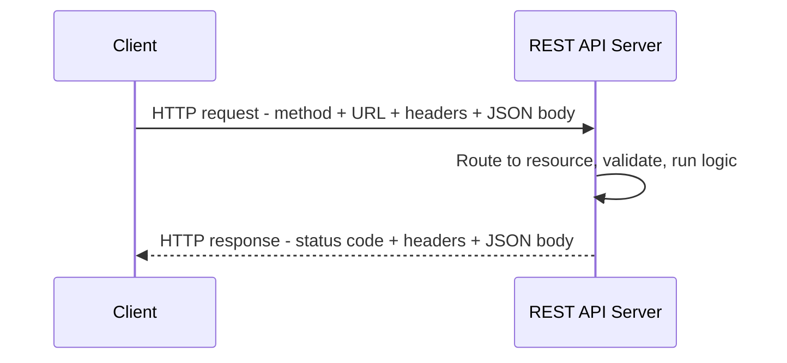

## Figure 2.1: Overview use case diagram.

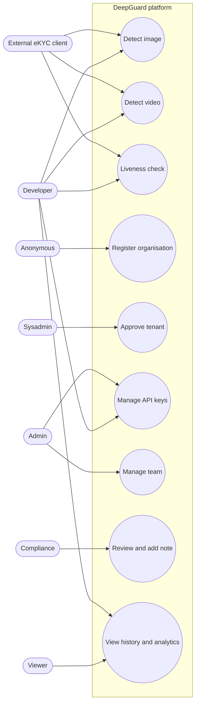

## Figure 2.3: Activity diagram for deepfake image detection.

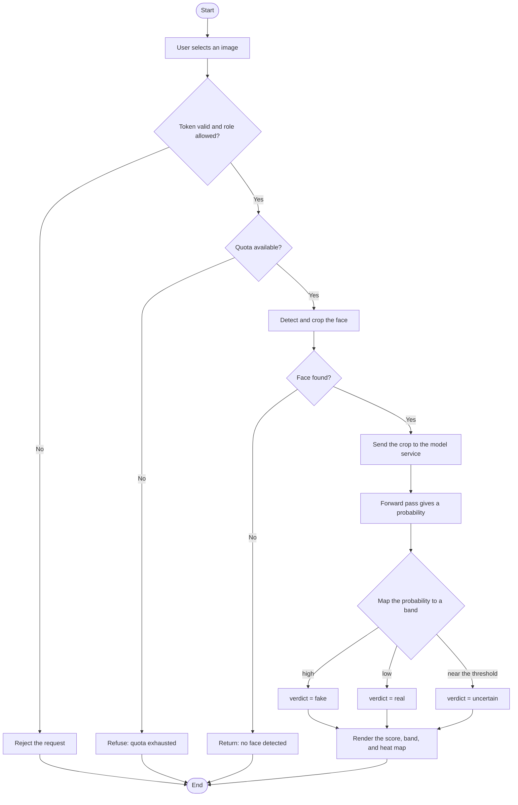

## Figure 2.4: Activity diagram for the eKYC cascade.

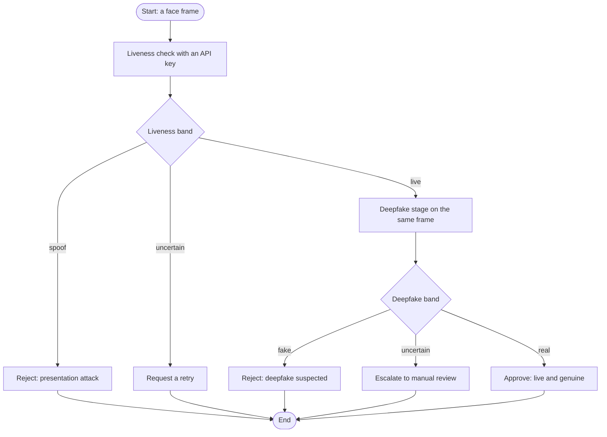

## Figure 2.5: Deepfake detection sequence diagram.

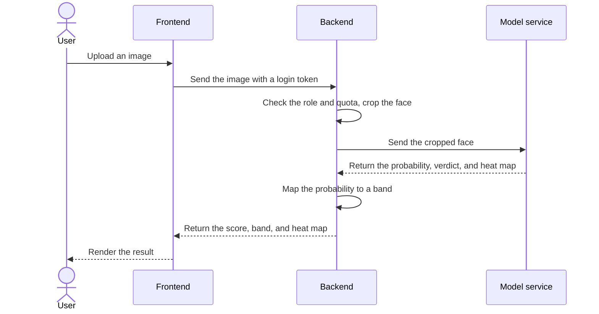

## Figure 2.6: eKYC cascade sequence diagram.

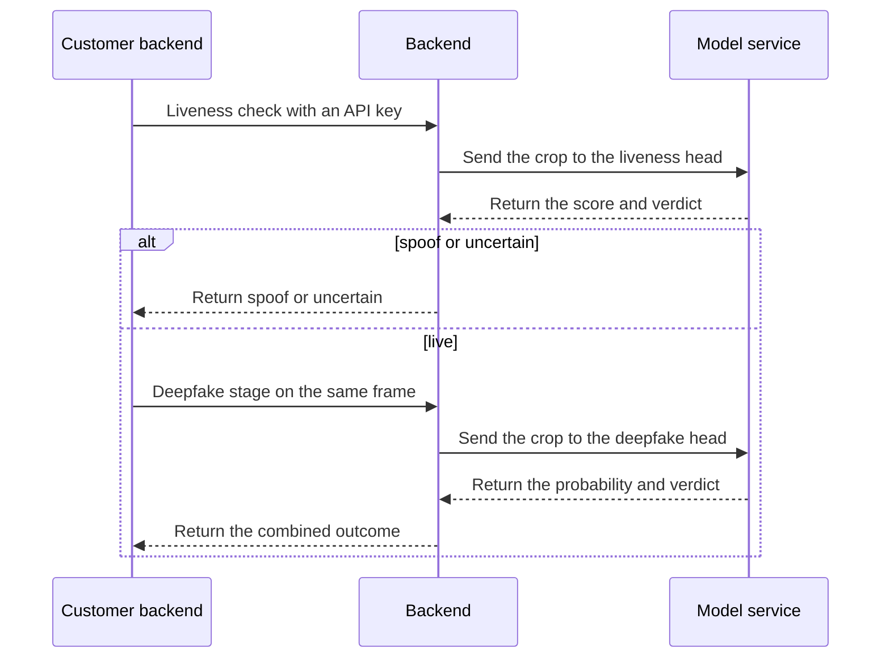

## Figure 2.7: Overall architecture of SFDCT.

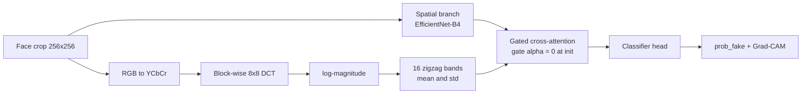

## Figure 2.8: Overall architecture of SFDCT-HFF.

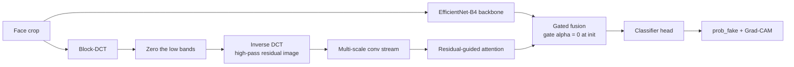

## Figure 2.9: Architecture of the B4-liveness baseline.

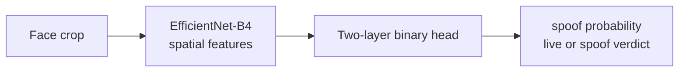

## Figure 2.10: Architecture of the B4+DCT-liveness proposal.

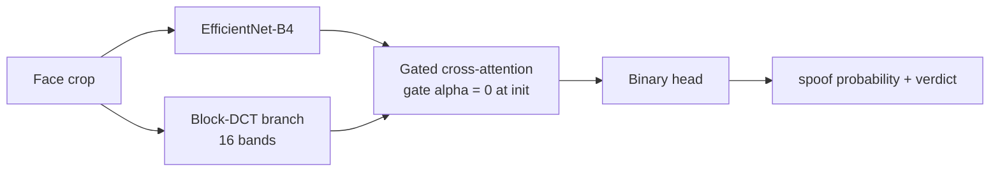

## Figure 3.24: Deployment of DeepGuard on a single cloud instance. A reverse proxy terminates HTTPS and forwards to the four containers on a private network; the backend reaches the database and the model service only over the internal network.

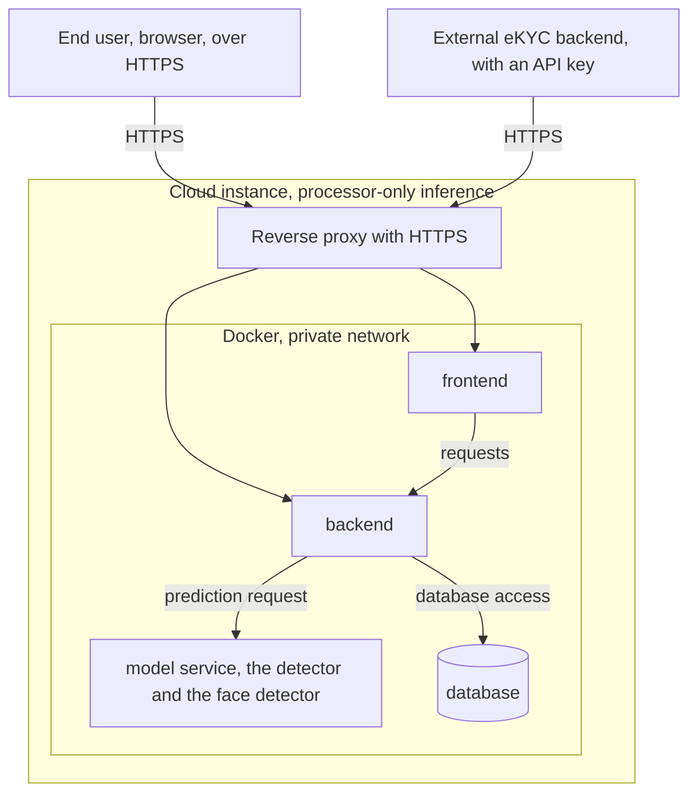
