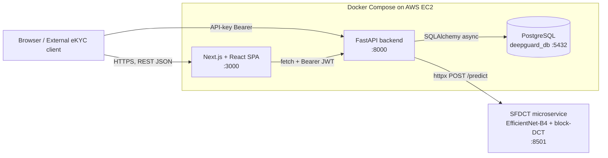

### 1.9 Application technologies

The previous sections established the *scientific* foundations of the detector (spatial backbone, block-DCT branch, attention fusion). This section turns to the *engineering* foundations: the set of production technologies that wrap the SFDCT model into a usable, multi-tenant eKYC platform, **DeepGuard**. The platform follows a strict one-directional request flow in which the browser never talks to the database or to the model directly: `Frontend (Next.js) → FastAPI backend (/v1, JWT/API-key) → SQLAlchemy async → PostgreSQL`, with model inference delegated over HTTP (`httpx POST /predict`) to a separate SFDCT microservice on port 8501. Figure 1.20 summarises this layered topology, and the subsections that follow describe each technology together with its concrete role inside DeepGuard.

*Figure 1.20: Layered technology stack of the DeepGuard platform. The frontend single-page application communicates only with the FastAPI backend over HTTP/REST; the backend is the sole component that touches PostgreSQL and the SFDCT model serving microservice. The dashed group denotes the components packaged and orchestrated by Docker Compose and deployed on an AWS EC2 instance.*

Table 1.20 maps each application technology to the architectural tier in which it is used and to its primary responsibility within DeepGuard.

*Table 1.20: Application technologies and their roles in DeepGuard.*

| Technology | Tier | Role in DeepGuard |
|---|---|---|
| React / Next.js (App Router) | Presentation | Single-page dashboard and integration playground |
| FastAPI (Uvicorn) | Application / API | REST API gateway, business logic, orchestration |
| PostgreSQL (SQLAlchemy async) | Persistence | Multi-tenant data store (`deepguard_db`) |
| Docker / Docker Compose | Infrastructure | Containerisation and local/dev orchestration |
| HTTP / REST | Communication | Contract between all tiers and external clients |
| JWT + RBAC | Security | Dashboard authentication and role-based authorisation |
| API-key authentication | Security | External eKYC integration auth |
| AWS EC2 | Deployment | Cloud host for the containerised stack |

#### 1.9.1 React / Next.js — frontend single-page application

The user-facing layer of DeepGuard is built with **React 19** running under the **Next.js 16 App Router** in TypeScript. Next.js provides the routing, server-component model, and build tooling, while React provides the component-based rendering; together they deliver the platform as a single-page application served on port 3000. Within DeepGuard, this layer renders the role-specific dashboards (sysadmin, admin, developer, compliance, viewer), the integration **Playground** where a developer can upload an image and immediately see the returned risk score, Grad-CAM heatmap, and 2D-DCT frequency spectrum, and the administrative screens for tenants, team members, API keys, webhooks, and audit logs. The frontend never queries the database or the model directly: all data movement goes through a single HTTP client module (`src/lib/api.ts`) that attaches the `Authorization: Bearer` header (a JWT for dashboard users, an API key for external integration) and calls the FastAPI backend. Server-state caching is handled by TanStack Query while a small amount of client-only state (authentication, navigation, appearance) lives in Zustand, keeping the UI responsive and consistent with the request flow shown in Figure 1.20.

#### 1.9.2 FastAPI — backend API service

The application tier is a **FastAPI** service (served by **Uvicorn**) written in Python, exposing the platform's complete REST surface — a set of 35 endpoints grouped into authentication, users/tenant, API keys, detection, liveness, dashboard detections, webhooks, and analytics/audit. FastAPI is the only component permitted to reach the database and the SFDCT model; it enforces the one-directional flow `router → service → repository (CRUD)` and never lets a route touch PostgreSQL directly. Its role in DeepGuard is to authenticate and authorise every request, validate inputs and serialise outputs through Pydantic v2 schemas (separate Create / Read / Update models), persist and query records via SQLAlchemy, and — for detection requests such as `POST /v1/detect/image` — orchestrate inference by forwarding the face-cropped payload to the SFDCT microservice over `httpx` and returning the structured verdict (`prob_fake`, label, Grad-CAM). The backend deliberately keeps heavy machine-learning dependencies out of its own runtime: the model lives behind the microservice boundary, so the API process only needs an HTTP client to obtain predictions. FastAPI also auto-generates interactive API documentation (Swagger UI at `/docs`), which doubles as the integration reference for external eKYC clients.

#### 1.9.3 PostgreSQL — multi-tenant persistence

Persistent state is stored in **PostgreSQL**, accessed asynchronously through **SQLAlchemy 2.0** (async) with the `asyncpg` driver. All schema, models, and data-access code are concentrated in a single shared package, `deepguard_db`, so that database structure is defined once (`schema.sql`) and every read or write passes through typed CRUD functions rather than ad-hoc SQL scattered across services. Within DeepGuard, PostgreSQL is the system of record for the multi-tenant data model: tenants and their subscription/quota state, users and their roles, API keys, detection and liveness records, webhooks, and the immutable audit trail. Tenancy isolation is expressed at this tier — every dashboard query is scoped by the authenticated user's `tenant_id` and every external request by the API key's `tenant_id` — which is what allows a single deployment to serve many independent banking organisations (for example the "VietBank Demo" tenant) while keeping their data strictly separated.

#### 1.9.4 Docker and Docker Compose — containerisation

DeepGuard is packaged with **Docker** and orchestrated for local and development environments with **Docker Compose**. Each tier runs as a container, and Compose wires the backend API and the PostgreSQL database together on a shared network, managing ports, environment configuration, and start order so that developers run the full stack with a single command instead of starting Uvicorn and a database by hand. Compose is also where configuration is injected through environment variables (consumed by the backend via `pydantic-settings`), keeping secrets, connection strings, and the SFDCT inference URL out of the source code. This containerised packaging is what makes the platform reproducible across a developer laptop and the cloud host described in Subsection 1.9.8.

#### 1.9.5 HTTP and the REST API

All communication in DeepGuard travels over **HTTP** using a **REST** style with JSON payloads, which is the single contract that ties the tiers together and exposes the platform to the outside world. The browser reaches the backend over HTTPS; the backend reaches the SFDCT microservice over HTTP via `httpx`; and external bank back-ends call the public detection API the same way. Endpoints are organised by resource and HTTP verb — for example `POST /v1/detect/image` and `POST /v1/detect/video` for forgery detection, `POST /v1/detect/liveness` and `GET /v1/liveness/challenge` for liveness, and `GET /v1/results/{request_id}` to retrieve a stored result. Responses follow consistent conventions: a `{items, total, page, limit}` envelope for paginated lists, a `{"detail": "..."}` body for errors, and standard status codes for failure modes (for example `429` with a `Retry-After` header when a key exceeds its `rate_limit_rpm`, and `402` when a tenant's `monthly_quota` is exhausted). Table 1.21 illustrates the REST contract on the central detection endpoint.

*Table 1.21: REST contract for the primary detection endpoint.*

| Field | Value |
|---|---|
| Method | POST |
| Path | `/v1/detect/image` |
| Auth | API Key (`Authorization: Bearer sk-dg-...`) |
| Request | `multipart/form-data` image file (face-cropped via MTCNN before inference) |
| Response (200) | `{ "request_id": "...", "verdict": "FAKE", "prob_fake": 0.93, "gradcam_b64": "..." }` |
| Errors | `401` invalid key · `402` quota exhausted · `429` rate limit · `422` invalid payload |

#### 1.9.6 JWT and RBAC — dashboard authentication and authorisation

The interactive dashboard is protected by **JSON Web Tokens (JWT)** combined with **role-based access control (RBAC)**. After a user signs in (`POST /auth/login`), the backend issues a signed bearer token that the frontend attaches to every subsequent request; server-side dependencies (`get_current_user`, `require_role`, `require_sysadmin`) verify the token and then check the caller's role against the minimum role declared by each endpoint. DeepGuard defines five roles — `viewer`, `developer`, `compliance`, `admin`, and `sysadmin` — and the authorisation rules realise meaningful separation of duties: a `viewer` is read-only with personally identifiable information (PII) masked; a `developer` may use the Playground and manage API keys but cannot see team, billing, or unmasked PII; a `compliance` user sees full PII and can add audit notes but cannot touch keys or playground; an `admin` governs a single tenant (team, keys, webhooks, settings) without crossing tenant boundaries; and only a `sysadmin` operates across all tenants and adjusts model thresholds. This role-to-route matrix is enforced authoritatively in the backend, giving DeepGuard the controlled, auditable access model required for an eKYC system.

#### 1.9.7 API-key authentication — external integration

External integration follows a second, deliberately separate authentication scheme based on **API keys**. A tenant administrator (or developer) issues a key of the form `sk-dg-...`, whose plaintext value is shown exactly once at creation and thereafter stored only as a hash. A customer's own back-end then authenticates to the public detection and liveness endpoints (`/v1/detect/*`, `/v1/liveness/*`, `/v1/results/*`) by sending this key as a bearer token, which the backend resolves to the owning tenant via `get_api_key_auth`. Keeping API-key auth distinct from the JWT dashboard auth — the two guards are never mixed — is what lets DeepGuard serve two different consumers cleanly: human operators using the web console, and machine-to-machine eKYC pipelines calling the API at scale, each with its own quota and per-key rate limit.

#### 1.9.8 AWS EC2 — cloud deployment

For deployment beyond the developer machine, the containerised DeepGuard stack is hosted on an **Amazon Web Services (AWS) EC2** virtual server. EC2 provides the elastic compute instance on which Docker runs the frontend, backend, and PostgreSQL containers as a single Compose-orchestrated unit reachable over HTTPS. In the DeepGuard architecture, EC2 is the production host that exposes the platform to bank operators and to external eKYC integrations, while the underlying topology — the strict tiering, the model-serving boundary, and the dual authentication schemes described above — remains identical to the local environment, so that what is validated under Docker Compose locally is exactly what runs in the cloud.
