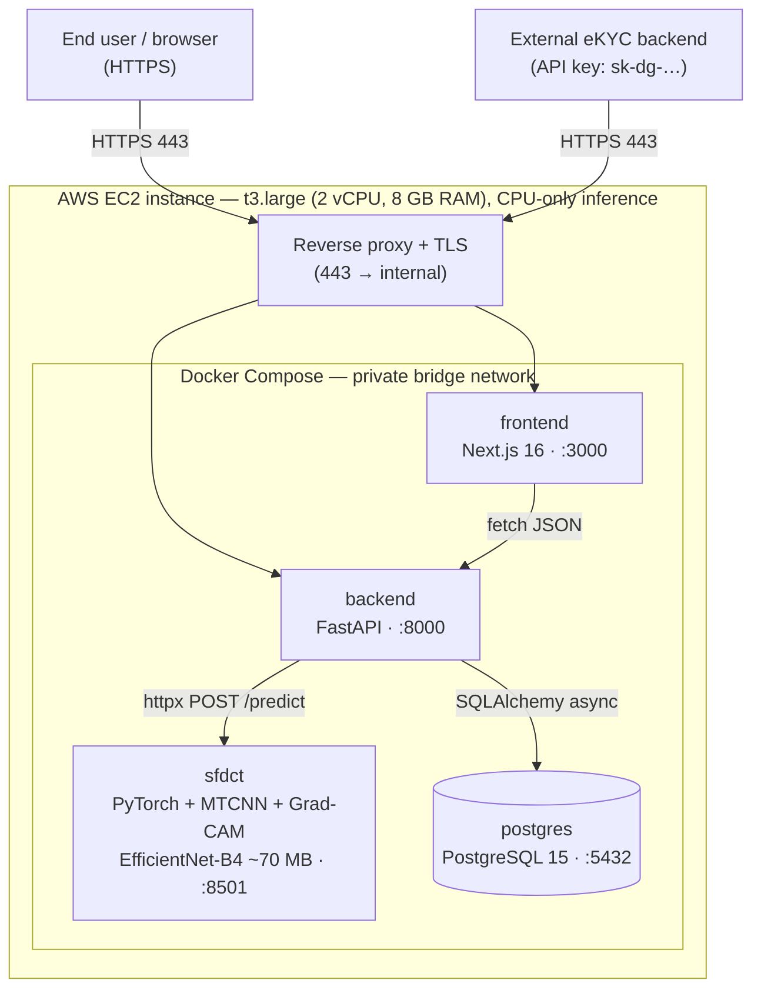

## 3.9 Implementing the System

The preceding sections validated the **SFDCT** detector as a research artefact: a cross-dataset frame-level AUC of approximately **0.75** on Celeb-DF-v2, a calibrated decision threshold for the FPR ≤ 5% requirement of Circular 17/2024/TT-NHNN, and a full suite of explainability visualisations. This section describes how that artefact is wrapped into a working, multi-tenant web application — **DeepGuard** — and how the application is packaged and deployed so that it can be demonstrated end to end. The description is deliberately candid: what follows is a **demonstration (demo) deployment** intended for the thesis defence and for manual functional testing, not a production-hardened banking installation. Throughout, the trained model is treated as a **signal layer** (a risk score with an explanation), not as a standalone gatekeeper; the final accept/reject decision in a real eKYC pipeline must combine this signal with liveness, document checks, and human review.

### 3.9.1 Technology stack

DeepGuard is organised as three cooperating tiers behind a single PostgreSQL database, following the one-directional request flow fixed in the project conventions: `Frontend → FastAPI → Service → Repository → PostgreSQL`, with machine-learning inference delegated over HTTP to a separate **SFDCT microservice**. The backend never imports PyTorch directly; it communicates with the model only through `httpx POST` calls, which keeps the API container lightweight and lets the model be scaled or replaced independently. Table 3.20 maps each architectural layer to the concrete technology chosen for it.

*Table 3.20: Technology stack of the DeepGuard system, organised by architectural layer.*

| Layer | Technology | Role in the system |
|---|---|---|
| **Presentation (Frontend)** | Next.js 16 (App Router) · React 19 · TypeScript 5 · Tailwind CSS 4 · shadcn/ui (Radix UI) | Single-page dashboard; role-aware UI; Playground for upload-and-analyse |
| **Client state / data** | Zustand 5 (auth, navigation, appearance) · TanStack Query 5 · react-hook-form + zod | Auth/session and UI state; server-data caching; form validation |
| **API client** | Fetch API in `src/lib/api.ts` (Bearer JWT / API key) | Single gateway from browser to backend |
| **Application (Backend)** | FastAPI 0.115 · Uvicorn · Python 3.11 | REST API; routing → service → repository; RBAC enforcement |
| **Authentication / RBAC** | JWT (python-jose) for the dashboard · API key (`sk-dg-…`) for external eKYC integration · passlib[bcrypt] | Two non-mixed auth layers; five roles via `require_role` |
| **Validation / config** | Pydantic 2 · pydantic-settings (`.env`) | Create/Read/Update schemas; no hard-coded secrets or ports |
| **Data access (ORM)** | SQLAlchemy 2.0 (async) · asyncpg · shared `deepguard_db` package | Repository layer; `schema.sql` migrations only |
| **Database** | PostgreSQL 15 (`postgres:15-alpine`) | Tenants, users, API keys, detections, audit logs |
| **HTTP-to-model bridge** | httpx 0.28 | Backend → SFDCT `POST /predict` |
| **Model serving (SFDCT)** | FastAPI microservice `serving/infer_server.py` · PyTorch · EfficientNet-B4 + block-DCT branch · MTCNN face crop · Grad-CAM (base64) | `prob_fake` + REAL/FAKE label + Grad-CAM heat-map |
| **Containerisation** | Docker · Docker Compose | Single-host orchestration of all four services |
| **Model / data storage** | HuggingFace Hub (`huanthuytnhh/deepfake`, `…/deepfake-data`) | Checkpoint and dataset distribution |

The default ports inside the deployment are **3000** (frontend), **8000** (backend API, Swagger at `/docs`), **8501** (SFDCT microservice), and **5432** (PostgreSQL).

### 3.9.2 Deployment environment

The entire system is deployed onto a **single AWS EC2 instance** and orchestrated with **Docker Compose**. All four services — the Next.js frontend, the FastAPI backend, the SFDCT model microservice, and PostgreSQL — run as containers on the same host, sharing a private Docker bridge network so that the backend reaches PostgreSQL and the SFDCT microservice purely over internal hostnames; only the reverse-proxy port is exposed publicly. This co-located, single-host topology is intentional for a demo: it keeps the deployment reproducible with one `docker compose up`, avoids the cost and operational overhead of a multi-node cluster, and matches the scale of a defence demonstration.

A key practical decision is that **inference runs on CPU**, with no GPU required. The served detector is an EfficientNet-B4-based checkpoint of roughly **70 MB**; on CPU it produces a verdict and a Grad-CAM heat-map in approximately **0.3–1 second per image**, which is comfortably within interactive latency for an eKYC review screen and for the live demo. Because no GPU is needed at serving time, the cost driver becomes **RAM rather than compute**: the resident memory is dominated by the PyTorch runtime plus the MTCNN face detector loaded inside the SFDCT microservice, alongside PostgreSQL and the Node/Next.js process. For this reason the recommended instance type is a **t3.large (2 vCPU, 8 GB RAM)** — chosen so that PyTorch + MTCNN, the API, the database, and the frontend can all reside comfortably without swapping, rather than for raw CPU throughput. Smaller burstable instances are sufficient to *boot* the stack but tend to thrash once the model and face detector are both resident.

Figure 3.20 shows the deployment topology: the public-facing reverse proxy terminating HTTPS, and the four containers behind it on the internal Docker network.

*Figure 3.20: Deployment diagram of DeepGuard on a single AWS EC2 instance (t3.large, CPU-only). A reverse proxy terminates HTTPS and forwards to the four Docker Compose services on a private bridge network; the backend reaches PostgreSQL and the SFDCT microservice only over the internal network.*

### 3.9.3 Domain and HTTPS

Public access is provided through a registered domain name whose DNS A-record points to the Elastic IP of the EC2 instance. A **reverse proxy** on the host terminates TLS and routes incoming HTTPS (port 443) traffic to the appropriate container: requests for the dashboard are forwarded to the Next.js frontend on port 3000, while requests under the API prefixes (`/auth`, `/v1/…`, and the other dashboard resources) are forwarded to the FastAPI backend on port 8000. A standard automated certificate-management flow (an ACME-issued certificate) supplies the TLS material so that all browser traffic and all external eKYC integrations travel over HTTPS. Internally, the proxy is the **only** publicly bound port; the backend, the SFDCT microservice, and PostgreSQL remain reachable solely on the private Docker network, which prevents direct exposure of the database (5432) and the model service (8501).

It is worth restating two known limitations honestly, since they bear on a real deployment. Route guarding is currently performed **client-side** (Zustand) and the JWT is stored in `localStorage`; server-side route middleware is not yet in place. The interactive API documentation (`/docs`, `/redoc`) is left **public** for convenience during the demo and should be gated before any production exposure. These are acceptable for a defence demonstration but would need to be closed off in a hardened banking deployment.

### 3.9.4 System access

The deployed demo is reached over HTTPS at the public domain described above; the interactive backend documentation is available at the `/docs` path (Swagger UI on the FastAPI service). To make the role-based behaviour immediately demonstrable, the database is populated by the idempotent seed script `backend/scripts/seed.py`, which creates the tenant **"VietBank Demo"** together with one account for each of the five roles. All seed accounts share the password **`Password123!`**. Table 3.21 lists the demo credentials.

*Table 3.21: Seeded demonstration accounts (tenant "VietBank Demo", password `Password123!`).*

| Role | Email | Lands on |
|---|---|---|
| sysadmin | `sysadmin@deepguard.vn` | Platform dashboard (cross-tenant) |
| admin | `admin@vietbank.vn` | Tenant admin dashboard |
| developer | `dev@vietbank.vn` | Developer / integration dashboard |
| compliance | `compliance@vietbank.vn` | Compliance review dashboard |
| viewer | `viewer@vietbank.vn` | Read-only dashboard |

For a no-credentials walkthrough, the simplest path is to log in as the **developer** account, open the **API Playground**, and upload a face image: the page calls `POST /playground/detect/image` with the dashboard JWT (no API key required) and returns the **risk score**, the verdict **band** with a `decision_hint`, the **Grad-CAM** heat-map, and the **2D-DCT frequency spectrum** — the same explainability surface analysed in Section 3.5. External integration (a customer's backend calling `POST /v1/detect/image` with an `sk-dg-…` API key) is demonstrated separately from the developer's **API Keys** screen.

A final note on positioning, consistent with the discussion in Section 3.7: this is a **demo configuration**, and the served model is the cross-dataset checkpoint whose AUC is **approximately 0.75** on Celeb-DF-v2. That figure is honest and unembellished — strong enough to act as a useful **risk signal** with a transparent explanation, but **not** a perfect gatekeeper. The application is therefore engineered so that the model's output is one input to a reviewable decision (with verdict bands, an `UNCERTAIN` zone, compliance audit notes, and a human-in-the-loop review queue) rather than an automatic, unappealable verdict.
