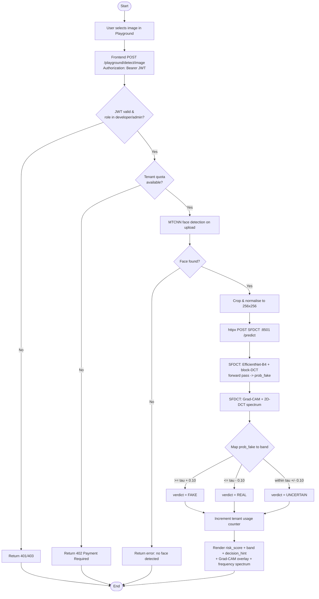
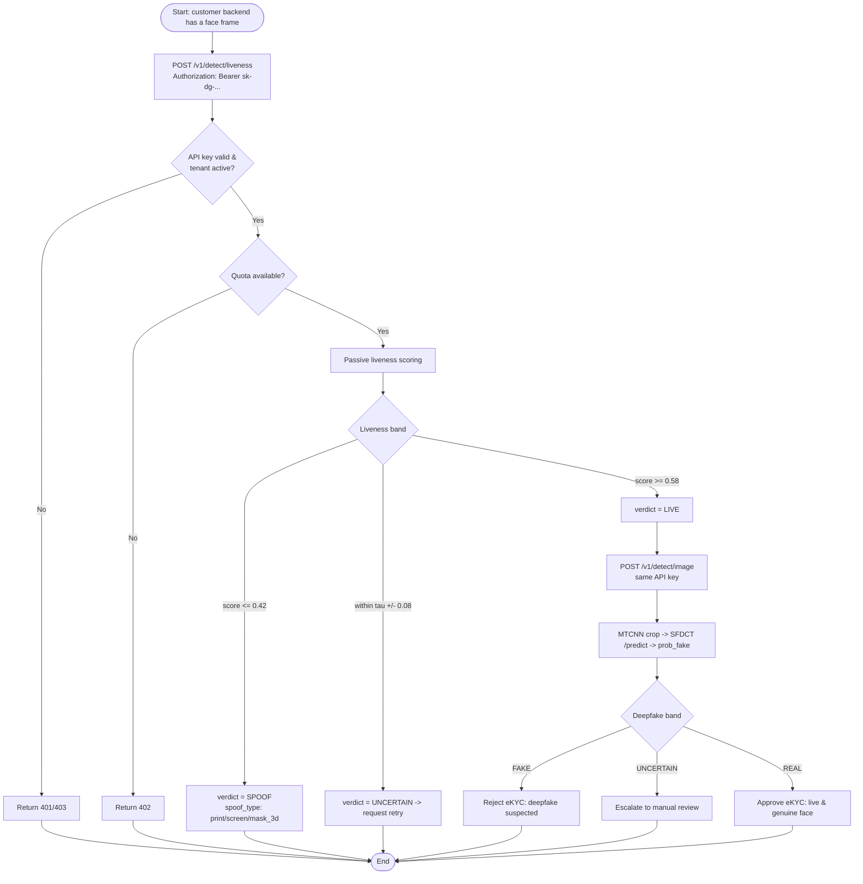
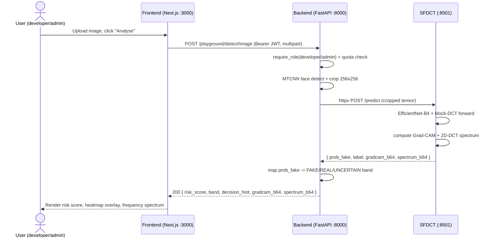
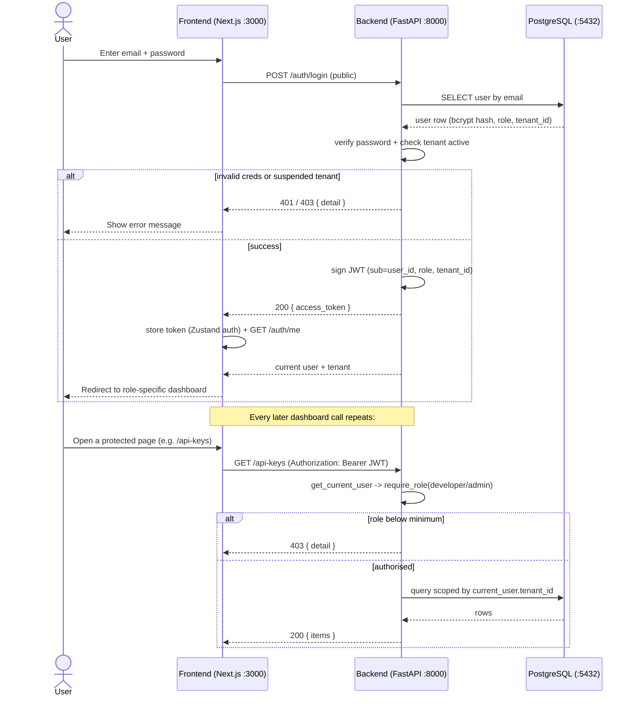
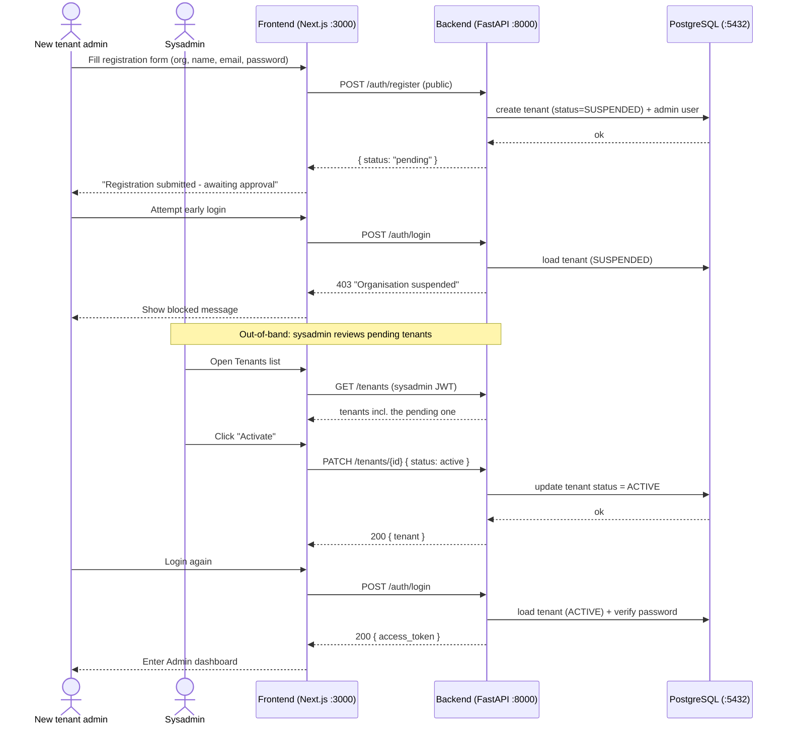

### 2.2.5 Activity diagrams

Whereas the use-case diagram (Section 2.2.1) and the overall architecture (Section 2.2.2) describe *what* the system does and *how its blocks are wired*, an activity diagram describes the *order in which work is carried out* — the control flow, the decision branches, and the points at which the flow may terminate early. For the **DeepGuard** application this is essential, because a single business action (for example, "analyse one image") triggers a chain that crosses three runtime tiers — the Next.js frontend, the FastAPI backend, and the SFDCT microservice — and because the eKYC pipeline composes two detectors (liveness then deepfake) in a cascade whose ordering carries strong security implications. This section presents the two most representative activities; the inter-tier message ordering of the same flows is then refined into sequence diagrams in Section 2.2.6.

**(a) Deepfake image detection.** The first activity covers the dashboard *Playground* path, in which an authenticated tenant user (a `developer` or `admin`, per the route matrix in Section 2.2.4) uploads a single image and receives a risk verdict together with explanations. The activity is interesting because of its two early-exit branches — when no face is detected and when the tenant's monthly quota is exhausted — and because of the band-mapping decision (`FAKE` / `REAL` / `UNCERTAIN`) governed by the `prob_fake` threshold ± 0.10 convention defined in the API specification.

*Figure 2.10: Activity diagram — deepfake image detection through the dashboard Playground (`POST /playground/detect/image`, JWT-authenticated). Two guard branches (RBAC and quota) and the mandatory MTCNN face-crop precede the SFDCT forward pass; the resulting `prob_fake` is mapped to a `FAKE`/`REAL`/`UNCERTAIN` band before the risk score, Grad-CAM heatmap, and 2D-DCT spectrum are returned to the user.*

The diagram makes explicit the two architectural invariants stated in `CONVENTIONS.md`: face cropping with **MTCNN is mandatory before any inference** (the flow can never reach the SFDCT call without a valid crop), and the SFDCT microservice is treated as a **black box reached only via `httpx POST /predict`**. Note also that the Playground path *counts* the tenant's quota but deliberately does **not** persist a row in the `detections` table — a known design decision documented in the role flows — which is why no "write detection record" node appears after the band mapping.

**(b) eKYC cascade — liveness then deepfake.** The second activity models the integration path used by an external customer backend through the API-key-authenticated `/v1/` endpoints. Here the order is security-critical: a presentation-attack (a printed photo or a replayed screen) must be rejected by **passive liveness** *before* any deepfake analysis is performed, so that compute is never spent on a frame that is not even a live capture. The cascade therefore short-circuits on a `SPOOF` verdict and only proceeds to `/v1/detect/image` when liveness returns `LIVE`.

*Figure 2.11: Activity diagram — eKYC cascade combining passive liveness (`POST /v1/detect/liveness`) and deepfake detection (`POST /v1/detect/image`) over API-key authentication. The cascade rejects presentation attacks early (`SPOOF`/`UNCERTAIN`) and only forwards a `LIVE` capture to the SFDCT deepfake stage; the final eKYC outcome combines both verdicts.*

This ordering reflects the threat model directly: liveness defends against print/screen/3-D-mask attacks (the `spoof_type` enum), while the deepfake stage defends against synthetic faces that may nonetheless pass a liveness check. The two stages share the same API key and both consume tenant quota, so the cascade is also the natural place where the per-key `rate_limit_rpm` (60 req/min by default) and the `monthly_quota` are exercised twice per verification attempt.

### 2.2.6 Sequence diagrams

A sequence diagram complements the activity diagrams above by fixing the *temporal ordering of messages between participants* — which component calls which, in which direction, and what each returns. For DeepGuard the participants are drawn from the four-tier architecture of `TECH_STACK.md`: the **Next.js frontend (:3000)**, the **FastAPI backend (:8000)**, the **PostgreSQL database (:5432)**, and the **SFDCT microservice (:8501)**. Three sequences are presented: the core image-detection round trip, the authentication-and-RBAC handshake, and the tenant-onboarding lifecycle.

**(c) Image detection (frontend → backend → SFDCT).** This sequence refines activity (a) into concrete inter-tier messages. It is the canonical request path of the whole product and the only place where the backend talks to the model: the FastAPI layer performs the **MTCNN crop**, forwards the normalised crop to the SFDCT microservice via `httpx`, receives `prob_fake` together with the base64 Grad-CAM, maps the score into a band, and returns a single JSON payload to the browser.

*Figure 2.12: Sequence diagram — single-image deepfake detection. The FastAPI backend performs the mandatory MTCNN crop, calls the black-box SFDCT microservice (`POST /predict`) over `httpx`, and assembles the risk score, decision hint, Grad-CAM, and 2D-DCT spectrum into one JSON response. Grad-CAM is returned inline as base64, never as a file path.*

The sequence highlights the one-directional, no-shortcut request flow mandated by the conventions: the frontend never contacts SFDCT directly, and SFDCT never touches PostgreSQL. The model tier is therefore fully replaceable behind the `/predict` contract `{prob_fake, label, gradcam_b64}`, and the inline-base64 Grad-CAM rule means no temporary files or filesystem paths are ever exposed.

**(d) Authentication and RBAC (login → JWT → require_role).** The second sequence covers how a dashboard session is established and how every subsequent protected call is gated. Login is a *public* endpoint that validates credentials against PostgreSQL (with a bcrypt hash check) and verifies that the tenant is active; on success it mints a stateless JWT. Each later dashboard request carries that JWT, and the backend dependency chain `get_current_user` → `require_role` enforces the minimum role declared by the endpoint.

*Figure 2.13: Sequence diagram — authentication and RBAC. `POST /auth/login` validates credentials and tenant status against PostgreSQL, then issues a stateless JWT; every subsequent protected request is gated by the `get_current_user` → `require_role` dependency chain, and all data queries are scoped to `current_user.tenant_id`.*

The diagram surfaces two security properties of the design. First, **tenant scoping is implicit**: because the JWT carries `tenant_id`, the backend never trusts a client-supplied tenant identifier, which prevents cross-tenant data access. Second, the JWT is **stateless** — logout merely writes an audit-log entry and the client discards the token, so a token remains valid until its expiry (a known limitation noted in the role-flows document). RBAC is enforced server-side by `require_role`/`require_sysadmin`; the Zustand-based client guard is purely a UX convenience and is not the security boundary.

**(e) Tenant onboarding (register → pending → sysadmin approve → login).** The final sequence captures the controlled B2B onboarding lifecycle. Self-service registration deliberately creates the tenant in a **suspended** state so that a `sysadmin` must approve it before the organisation's admin can log in — preventing uncontrolled self-granting of admin access. The sequence spans two actors (the prospective tenant admin and the platform `sysadmin`) and shows why an immediate login attempt after registration is rejected.

*Figure 2.14: Sequence diagram — tenant onboarding. `POST /auth/register` creates a tenant in the `SUSPENDED` state, so an early login is rejected with HTTP 403; only after a `sysadmin` activates the tenant via `PATCH /tenants/{id}` can the tenant admin authenticate successfully and reach the Admin dashboard.*

This "approve-before-use" lifecycle is the deliberate counterpart to the role matrix of Section 2.2.4: registration alone never confers usable privileges, and the only actor that can transition a tenant from `SUSPENDED` to `ACTIVE` is the platform `sysadmin` — the same actor that can create an already-active tenant directly via `POST /tenants`. Together, Figures 2.10–2.14 trace every externally observable DeepGuard behaviour, from a single inference round trip to the full multi-tenant access lifecycle, back to the concrete endpoints and authentication layers specified earlier in this chapter.
