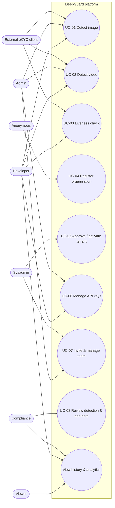

### 2.2.4 Use-case specifications

Beyond the SFDCT model that performs the core inference, DeepGuard is delivered as a multi-tenant web platform. This section formalises the application-level use cases — who may invoke each capability and under what conditions. The platform request flow is one-directional: the **Next.js** front-end (port 3000) calls the **FastAPI** back-end (port 8000) through `src/lib/api.ts`; the back-end resolves data exclusively through the `deepguard_db` layer against **PostgreSQL** (port 5432), and forwards any inference request over `httpx` to the **SFDCT** microservice (port 8501, EfficientNet-B4 + block-DCT + Grad-CAM). The platform exposes two strictly separated authentication layers: a **JWT Bearer** layer for the human dashboard (`get_current_user`, `require_role`, `require_sysadmin`) and an **API-key Bearer** layer (`Authorization: Bearer sk-dg-…`, `get_api_key_auth`) for external eKYC integration on the `/v1/*` namespace.

#### Actors

Six actor archetypes interact with DeepGuard. Five are authenticated dashboard roles (`UserRole`), arranged in a privilege hierarchy from level 0 (read-only) to level 4 (platform-wide); the sixth is the unauthenticated visitor. A tenant administrator and the system administrator operate the dashboard via JWT, whereas the customer's own back-end integrates with the public detection endpoints via an API key.

*Table 2.9: Actors of the DeepGuard platform.*

| Actor | Description |
|-------|-------------|
| **Anonymous** | An unauthenticated visitor. May browse the public landing, pricing and documentation pages, self-register a new organisation (`POST /auth/register`), or accept a team invitation (`GET/POST /auth/accept-invite`). Holds no JWT and sees no tenant data. |
| **Viewer** (`viewer`, level 0) | A read-only member of a tenant. May view detection history, liveness checks and analytics; PII (image, IP, user-agent) is masked. Cannot modify any resource. |
| **Developer** (`developer`, level 1) | A tenant member responsible for API integration. May run the JWT-authenticated Playground (`/playground/detect/*`), create and revoke API keys, and configure webhooks. PII is masked in detection detail. |
| **Compliance** (`compliance`, level 2) | A tenant member responsible for review and regulatory traceability (TT17/ND13). May view the FAKE queue with **full PII**, open detection detail and attach audit notes (`POST /detections/{id}/notes`). Read-only otherwise. |
| **Admin** (`admin`, level 3) | The administrator of a single tenant. Manages team members and roles, invites members, manages API keys and webhooks, reads audit logs, and configures the tenant — all scoped to the administrator's own `tenant_id`. Cannot cross organisations, create tenants, or edit model thresholds. |
| **Sysadmin** (`sysadmin`, level 4) | The platform operator, acting **across all tenants**. Creates and approves/activates tenants (`POST/PATCH /tenants`), inspects any tenant's users and keys, and is the only actor allowed to edit model versions and thresholds. Cannot assign the `sysadmin` role to a tenant member. |

#### Use-case diagram

Figure 2.9 presents the use-case diagram. The unauthenticated **Anonymous** actor and the five authenticated dashboard roles inherit privileges upward (each higher role subsumes the use cases of the roles below it). The external eKYC client, although technically driven by the same back-end that hosts a developer's API key, is drawn separately to highlight the API-key authentication boundary on the `/v1/*` endpoints.

*Figure 2.9: DeepGuard use-case diagram — six actors over the eight core use cases. Dashboard actors authenticate with JWT; the external eKYC client authenticates with an API key on the `/v1/*` namespace.*

#### Core use-case specifications

The eight core use cases are specified below following the standard template (name, identifier, actors, description, trigger, pre-/post-conditions, basic flow, alternative flow, exception flow). Each specification reflects the actual endpoints and role matrix of the implemented system.

*Table 2.10: Use-case specification — UC-01 Detect deepfake (image).*

| Field | Content |
|-------|---------|
| **Use Case Name** | Detect deepfake (image) |
| **Use Case ID** | UC-01 |
| **Actor(s)** | Developer, Admin (Playground, JWT); External eKYC client (`/v1`, API key) |
| **Description** | Submit a single image for deepfake analysis. The back-end crops the face with MTCNN and forwards it to the SFDCT microservice, which returns a fake probability, a REAL/FAKE/UNCERTAIN verdict, a Grad-CAM heatmap and the 2D-DCT frequency spectrum. |
| **Trigger** | The actor uploads an image in the Playground and presses *Analyse*, or the client `POST`s an image to `/v1/detect/image`. |
| **Pre-condition** | Dashboard path: a valid JWT for a `developer`/`admin` in an active tenant. API path: a valid `sk-dg-…` key; the tenant's `current_usage < monthly_quota`. |
| **Post-condition(s)** | A detection result is produced and returned as JSON; quota is consumed by one unit on the `/v1` path; the result is retrievable via `GET /v1/results/{request_id}`. |
| **Basic Flow** | 1. The actor submits the image. 2. The back-end authenticates (JWT or API key) and checks quota. 3. MTCNN detects and crops the face. 4. The back-end forwards the crop to SFDCT over `httpx`. 5. SFDCT returns `prob_fake`, label and `gradcam_b64`. 6. The back-end derives the verdict (FAKE if `prob_fake ≥ τ + 0.10`, REAL if `≤ τ − 0.10`, otherwise UNCERTAIN). 7. The result, heatmap and frequency spectrum are returned and displayed. |
| **Alternative Flow** | A1. If the actor uses the Playground (JWT), quota is counted but the result is **not** persisted to the `detections` table. A2. The score lands in the ±0.10 band → the verdict is returned as UNCERTAIN. |
| **Exception Flow** | E1. No face detected → an error message is returned. E2. Invalid/missing token → 401. E3. `current_usage ≥ monthly_quota` → 402. E4. SFDCT microservice unreachable → 5xx with a `{"detail": …}` envelope. |

*Table 2.11: Use-case specification — UC-02 Detect deepfake (video).*

| Field | Content |
|-------|---------|
| **Use Case Name** | Detect deepfake (video) |
| **Use Case ID** | UC-02 |
| **Actor(s)** | Developer, Admin (Playground, JWT); External eKYC client (`/v1`, API key) |
| **Description** | Submit a video for deepfake analysis. The back-end samples frames, runs per-frame SFDCT inference and aggregates an overall verdict; long videos are processed as an asynchronous job that the client polls. |
| **Trigger** | The actor uploads a video in the Playground, or the client `POST`s to `/v1/detect/video`. |
| **Pre-condition** | A valid JWT (`developer`/`admin`) or a valid API key; quota available on the `/v1` path. |
| **Post-condition(s)** | An aggregated verdict and a per-frame grid are returned; for async processing a `job_id` is issued and pollable via `GET /v1/jobs/{job_id}`. |
| **Basic Flow** | 1. The actor submits the video. 2. The back-end authenticates and checks quota. 3. Representative frames are sampled. 4. Each frame is face-cropped and sent to SFDCT. 5. Per-frame scores are aggregated into a single verdict. 6. The aggregated verdict plus the frame grid are returned. |
| **Alternative Flow** | A1. Large video → the request returns a `job_id`; the client polls `GET /v1/jobs/{job_id}` until the job completes, then fetches the result. A2. Playground (JWT) path counts quota but does not persist to `detections`. |
| **Exception Flow** | E1. No face in any sampled frame → error. E2. 401 on invalid token. E3. 402 when quota exceeded. E4. Job failure surfaced as a failed status on `GET /v1/jobs/{job_id}`. |

*Table 2.12: Use-case specification — UC-03 Liveness check.*

| Field | Content |
|-------|---------|
| **Use Case Name** | Liveness check (anti-spoofing) |
| **Use Case ID** | UC-03 |
| **Actor(s)** | Developer (Playground, JWT); External eKYC client (`/v1`, API key) |
| **Description** | Determine whether the subject is a live person rather than a print, screen replay, 3D mask or deepfake. Supports passive (single image) and active (multi-frame challenge–response) modes. |
| **Trigger** | The client `POST`s an image to `/v1/detect/liveness` (passive), or requests `GET /v1/liveness/challenge` then `POST /v1/detect/liveness/active` (active). |
| **Pre-condition** | A valid API key (or JWT for the Playground); for active mode, a previously issued challenge token. |
| **Post-condition(s)** | A liveness verdict is returned: LIVE (score ≥ 0.58), SPOOF (≤ 0.42) or UNCERTAIN (±0.08 band), with a spoof-type classification when SPOOF. |
| **Basic Flow** | 1. (Active) The client requests a random challenge (blink/turn/smile/nod). 2. The client captures the required frame(s). 3. The client submits the image(s) (and challenge for active mode). 4. The back-end runs the liveness model. 5. The verdict and, if applicable, spoof type (`print`/`screen`/`mask_3d`/`deepfake`/`unknown`) are returned. |
| **Alternative Flow** | A1. Passive mode skips steps 1–2 and submits a single image directly to `/v1/detect/liveness`. A2. Score in the ±0.08 band → UNCERTAIN is returned, prompting a re-capture. |
| **Exception Flow** | E1. No face / poor quality frame → error. E2. 401 on invalid key. E3. Expired/incorrect challenge token (active mode) → rejected. |

*Table 2.13: Use-case specification — UC-04 Register organisation (anonymous).*

| Field | Content |
|-------|---------|
| **Use Case Name** | Register organisation (self-service) |
| **Use Case ID** | UC-04 |
| **Actor(s)** | Anonymous |
| **Description** | A visitor self-registers a new organisation. The back-end creates a tenant in the **SUSPENDED** state together with an `admin` user; the organisation cannot be used until a sysadmin activates it (UC-05). |
| **Trigger** | The visitor presses *Try for free* / a pricing-plan button on the landing page and submits the registration form. |
| **Pre-condition** | The visitor is not authenticated; the submitted email is not already registered. |
| **Post-condition(s)** | A SUSPENDED tenant and its admin user exist; a "registration submitted — awaiting approval" screen is shown. The account cannot yet log in. |
| **Basic Flow** | 1. The visitor opens `/` and navigates to *Register*. 2. The visitor enters organisation name, full name, email and password. 3. The visitor submits → `POST /auth/register`. 4. The back-end creates a SUSPENDED tenant + admin user. 5. The "awaiting approval" screen is displayed. |
| **Alternative Flow** | A1. The visitor instead opens an invitation link `/?invite=<token>` and joins an existing tenant via `POST /auth/accept-invite`, bypassing the approval wait. |
| **Exception Flow** | E1. The visitor attempts `POST /auth/login` immediately → blocked because the tenant is not active; the message "Organisation is suspended. Contact the platform administrator." is shown. E2. Duplicate email or invalid input → validation error. |

*Table 2.14: Use-case specification — UC-05 Approve / activate tenant (sysadmin).*

| Field | Content |
|-------|---------|
| **Use Case Name** | Approve / activate tenant |
| **Use Case ID** | UC-05 |
| **Actor(s)** | Sysadmin |
| **Description** | The platform operator reviews tenants and activates a self-registered (SUSPENDED) organisation, or creates a new tenant directly. Direct creation activates the tenant immediately and reveals a one-time temporary admin password. |
| **Trigger** | The sysadmin opens *Tenant management* and activates a pending tenant, or runs the *Create tenant* wizard. |
| **Pre-condition** | A valid JWT with the `sysadmin` role. |
| **Post-condition(s)** | The target tenant's status becomes **active**; its admin user can now log in. For direct creation, a temporary password is displayed exactly once. |
| **Basic Flow** | 1. The sysadmin logs in → `SysadminDashboard`. 2. The sysadmin opens *Tenant management* (`GET /tenants`). 3. The sysadmin selects the pending tenant. 4. The sysadmin activates it → `PATCH /tenants/{id}` with `status=active`. 5. The tenant status updates instantly and the admin may now log in. |
| **Alternative Flow** | A1. *Create tenant* — the 3-step wizard calls `POST /tenants`; the tenant is **ACTIVE immediately** and an admin account plus a one-time temporary password are shown. A2. The sysadmin may suspend, change plan or adjust quota via `PATCH /tenants/{id}`. |
| **Exception Flow** | E1. A non-sysadmin attempts the operation → `require_sysadmin` rejects with 403. E2. Invalid tenant id → 404. |

*Table 2.15: Use-case specification — UC-06 Manage API keys (developer / admin).*

| Field | Content |
|-------|---------|
| **Use Case Name** | Manage API keys |
| **Use Case ID** | UC-06 |
| **Actor(s)** | Developer, Admin |
| **Description** | Create, inspect, update and revoke the `sk-dg-…` API keys used by the tenant's external eKYC integration. The plain key value is shown exactly once at creation time. |
| **Trigger** | The actor opens the *API Keys* page and creates, edits or revokes a key. |
| **Pre-condition** | A valid JWT with the `developer` or `admin` role in an active tenant. |
| **Post-condition(s)** | The key set of the tenant is changed; a newly created key's plain value is revealed once and never again; revoked keys can no longer authenticate `/v1/*` requests. |
| **Basic Flow** | 1. The actor opens *API Keys* → `GET /api-keys`. 2. The actor presses *Create key* → `POST /api-keys`. 3. The back-end returns the plain key, shown once for copying. 4. The actor may later inspect (`GET /api-keys/{key_id}`) or update name/quota/rate-limit/status (`PATCH /api-keys/{key_id}`). |
| **Alternative Flow** | A1. The actor revokes a key → `DELETE /api-keys/{key_id}`; subsequent `/v1/*` calls with that key fail authentication. |
| **Exception Flow** | E1. A `viewer`/`compliance`/`sysadmin` attempts the operation → `require_role` rejects with 403. E2. Invalid key id → 404. |

*Table 2.16: Use-case specification — UC-07 Invite & manage team (admin).*

| Field | Content |
|-------|---------|
| **Use Case Name** | Invite & manage team |
| **Use Case ID** | UC-07 |
| **Actor(s)** | Admin (Sysadmin may also manage users) |
| **Description** | The tenant administrator builds the team: invites new members by email, creates users with a role, changes roles, enables/disables, soft-deletes and resets passwords — all scoped to the administrator's own tenant. |
| **Trigger** | The admin opens *Team & Roles* and invites or edits a member. |
| **Pre-condition** | A valid JWT with the `admin` role (or `sysadmin`). |
| **Post-condition(s)** | The tenant's user set is updated; an invitation produces a link `/?invite=<token>`; a reset issues a one-time temporary password and forces a first-login change. |
| **Basic Flow** | 1. The admin opens *Team & Roles* → `GET /users`. 2. The admin invites a member → `POST /users/invite`, receiving an invite link. 3. The invitee opens `/?invite=<token>`, sets name and password → `POST /auth/accept-invite`, and is auto-logged-in with the invited role. 4. The admin may change role/name/active state → `PATCH /users/{user_id}`, or soft-delete → `DELETE /users/{user_id}`. |
| **Alternative Flow** | A1. The admin creates a member directly via `POST /users` (viewer/developer/admin) instead of inviting. A2. The admin resets a member's password → `POST /users/{id}/reset-password`, surfacing a one-time temporary password. |
| **Exception Flow** | E1. The admin attempts to manage a `compliance`/`sysadmin` user, or to self-demote/self-delete → blocked by separation-of-duties. E2. Expired/used/invalid invite token → `accept-invite` returns `valid:false` with a reason. E3. Non-admin actor → 403. |

*Table 2.17: Use-case specification — UC-08 Review detection & add audit note (compliance).*

| Field | Content |
|-------|---------|
| **Use Case Name** | Review detection & add audit note |
| **Use Case ID** | UC-08 |
| **Actor(s)** | Compliance (Admin may also add notes) |
| **Description** | The compliance officer reviews the queue of suspected deepfakes, opens a detection with **full PII** (image, IP, user-agent) and attaches an investigation note for regulatory traceability under TT17/ND13. |
| **Trigger** | The compliance officer opens the FAKE queue and selects a detection to review. |
| **Pre-condition** | A valid JWT with the `compliance` (or `admin`) role; the detection belongs to the actor's tenant. |
| **Post-condition(s)** | An audit note is attached to the detection record and persisted; the action is captured in the audit trail. |
| **Basic Flow** | 1. The officer logs in → `ComplianceDashboard`. 2. The officer opens the FAKE queue → `GET /detections?verdict=FAKE`. 3. The officer opens one record → `GET /detections/{request_id}` (PII shown in full for this role). 4. The officer writes an investigation note → `POST /detections/{request_id}/notes`. 5. The note is attached to the case file. |
| **Alternative Flow** | A1. The officer cross-references the audit trail via `GET /audit-logs` and exports findings. |
| **Exception Flow** | E1. A `viewer`/`developer` opens the same detection → PII is **masked** and the notes endpoint is forbidden (403). E2. Invalid `request_id` → 404. |

*Table 2.18: Selected API specification for the core detection use cases.*

The following entry illustrates the request/response contract of the principal public endpoint backing UC-01; the remaining `/v1/*` endpoints follow the same envelope conventions (paginated lists, `{"detail": …}` errors, the verdict/spoof-type enumerations defined in the API specification).

| Field | Content |
|-------|---------|
| **Method** | POST |
| **Path** | `/v1/detect/image` |
| **Auth** | API-key Bearer (`Authorization: Bearer sk-dg-…`) — tenant-scoped via `api_key.tenant_id` |
| **Request** | `multipart/form-data` with an image `file`; optional metadata fields. |
| **Response (200)** | `{ "request_id": "req_…", "verdict": "FAKE", "prob_fake": 0.93, "label": "FAKE", "gradcam_b64": "<base64-PNG>" }` |
| **Error codes** | 401 (invalid/missing key) · 402 (`current_usage ≥ monthly_quota`) · 422 (no face / invalid input) · 429 (`rate_limit_rpm` exceeded, with `Retry-After`) · 5xx (SFDCT microservice unavailable) |
