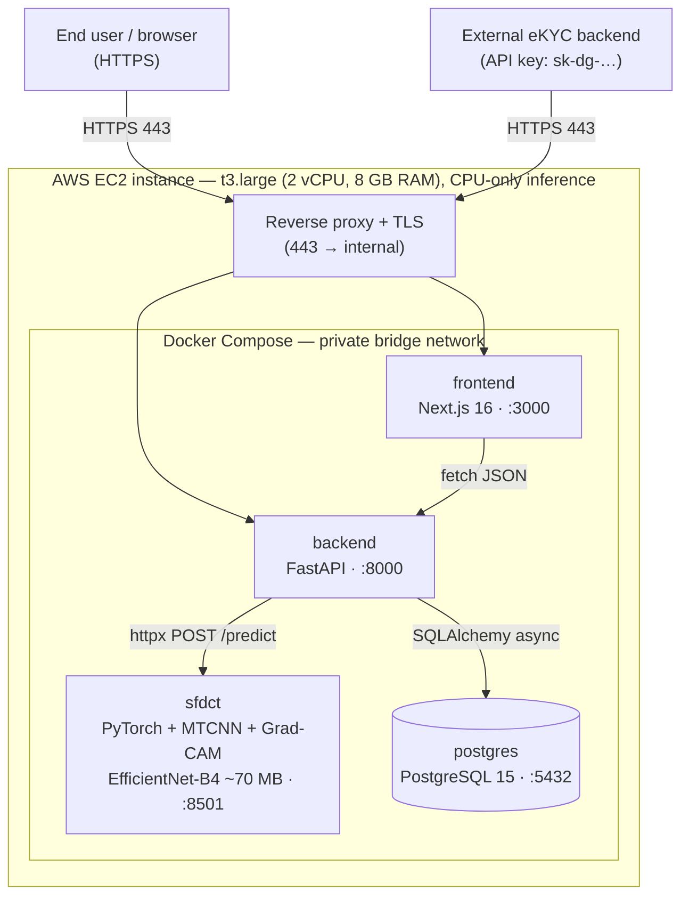

# CHAPTER 3: SYSTEM IMPLEMENTATION AND EVALUATION

Chapter 2 presented the analysis, design, and the two detection methods of the system: the **deepfake-detection** method built on **SFDCT** (Hybrid Spatial–Frequency Learning with Block-wise DCT) — an EfficientNet-B4 spatial backbone augmented with an 8×8 block-wise 2D-DCT frequency branch and merged through a *zero-initialised gated cross-attention* — and the **liveness-detection** method (a secondary module that reuses the same backbone for presentation-attack detection, trained and measured on LCC-FASD). Chapter 3 moves from design to **empirical validation and to a running system**. It is organised exactly as a results-and-deployment chapter: first the **experimental results** for both tasks (§3.1), then how the validated model is **implemented as a working web application** (§3.2), then the **application screens** that put the results in front of a user (§3.3), and finally a **conclusion** (§3.4).

The guiding objective throughout the chapter is to remain **honest and reproducible**. Every number confirmed from an experiment is stated verbatim and traceable to its raw source (`report/evidence/ablation_cdfv2/`, one-command reproduction scripts); every quantity that was *not* measured within the thesis budget — the FF++ in-dataset half of the grid, the Row2 configuration, the full per-lever table, DFDC, and the Vietnamese-face set — is named plainly in the Limitations rather than estimated, with no extrapolation. The liveness results in §3.1.8 are measured on the official LCC-FASD split and independently verified.

---

## 3.1 Experimental Results

This section reports results for the two tasks in the order of the thesis's priority: the **deepfake-detection task** (the primary contribution, fully measured under the standard cross-dataset protocol) and then the **liveness-detection task** (a secondary, measured module). Each task follows the same didactic arc Trí's thesis uses for its two models: first the data and preprocessing, then the design and training of each architecture, then a comparative evaluation, a discussion, and a conclusion.

### 3.1.1 Overview of the Deepfake-Detection Task — Data Collection and Preprocessing

#### Experimental environment

Before reading any number, the reader needs to know under what conditions those numbers were produced. A deepfake results report is meaningful only when the hardware, software, and measurement protocol are fixed and described transparently — this is also the spirit of **DeepfakeBench**, the standardised framework on which this thesis builds to guarantee a fair comparison.

The entire training-and-evaluation process is split into two phases following the *smoke-test-before-train* principle: a quick correctness test on the local machine, then full training on a rented GPU (vast.ai).

*Table 3.1: Hardware configuration used for the experiments.*

| Item | Local machine (smoke test) | Full-training machine |
|---|---|---|
| GPU | NVIDIA RTX 3050 (4 GB VRAM) | NVIDIA RTX 4090 (vast.ai, on-demand) |
| VRAM | 4 GB | 24 GB |
| System RAM | 32 GB | per-instance (not recorded) |
| Disk (dataset + ckpt) | ~300 GB NVMe (shared) | ≥ 150 GB provisioned |
| Purpose | shape → dry-run → overfit-1-batch | full training + evaluation |

The local machine only verifies pipeline correctness (checking tensor shapes, running a trial loop, and overfitting one batch to confirm the model can learn), because 4 GB of VRAM cannot hold a batch of 32 at 256×256. All full training and the final AUC measurements run on the rented GPU.

The software stack is version-pinned for reproducibility — this matters especially for the DCT branch, whose block-wise 2D-DCT transform and frequency statistics are sensitive to numerical differences between library versions, so only the **same seed on the same stack** reproduces the exact numbers.

*Table 3.2: Software stack.*

| Component | Version |
|---|---|
| Python | 3.10 (local analysis: 3.10.12) |
| PyTorch | 2.x / CUDA 12 image on the rented instance (local analysis: 2.6.0+cu124) |
| CUDA Toolkit | 12.x |
| cuDNN | bundled with the PyTorch 2.x/CUDA 12 image |
| torchvision | paired with the installed PyTorch (0.21.x for PyTorch 2.6) |
| numpy / opencv-python | 2.2.x / 4.x |
| Evaluation framework | DeepfakeBench (training/eval pipeline) |

To keep the ablation fair, **all** models share one set of hyperparameters; they differ only in whether the DCT branch and the levers S1–S5 are enabled.

*Table 3.3: Training hyperparameters shared across all models.*

| Hyperparameter | Value |
|---|---|
| Backbone | EfficientNet-B4 (ImageNet-pretrained) |
| Input resolution | 256 × 256 (face crop) |
| Normalisation | mean = std = 0.5 |
| Batch size | 32 |
| frame_num (train/test) | 32 / 32 |
| Optimizer | Adam (β₁ = 0.9, β₂ = 0.999, weight_decay = 5e-4) |
| Learning rate | 2e-4 |
| Scheduler | none |
| Compression | c23 |
| Train dataset | FaceForensics++ (c23) |
| Test dataset (headline) | Celeb-DF-v2 (cross-dataset) |
| Epochs | 10 |
| Seed | 1024 |
| Extra loss (naive SFDCT) | λ_cons = 1.0, λ_sc = 0.3, margin m = 0.3 |

A note on cost: because each full run consumes considerable rented-GPU time, the results in this chapter come from a **single seed**; this limitation is analysed in the Discussion. Per-model wall-clock training time on the rented RTX 4090, measured from the training-log timestamps, is: B4 ≈ 5.1 h, naive SFDCT ≈ 5.4 h, Row1 ≈ 2.9 h, Fix1 ≈ 1.6 h, Fix2 ≈ 1.6 h, and the block-DCT-HFF runs ≈ 1 h each (~5 min/epoch).

> **Takeaway.** The environment is fixed and version-pinned; the local machine only smoke-tests correctness, while all reported AUC numbers are produced on the rented GPU under one shared hyperparameter recipe.

#### Training dataset and test dataset

The quality and characteristics of the data directly determine any conclusion about generalisation. This thesis follows the **DeepfakeBench cross-dataset protocol** exactly: training **entirely on FaceForensics++** and testing **only on Celeb-DF-v2** — Celeb-DF-v2 never appears in training. This split faithfully simulates the real eKYC scenario, in which the model must face deepfake styles and face distributions it has never seen.

**FaceForensics++ (FF++)** is the training dataset: 1000 real videos plus four forgery methods — Deepfakes, Face2Face, FaceSwap, NeuralTextures — generated from those same 1000 source videos. The thesis uses the **c23** compressed version (light H.264 compression, closer to real-world video quality than the raw version). **Celeb-DF-v2 (CDFv2)** is the cross-dataset test set: 590 real videos and 5639 high-quality celebrity deepfakes; the high quality and subtle artefacts make it a stringent test of generalisation.

A **Vietnamese deepfake test set** is part of the thesis scope as a **test-only** probe of the model on Vietnamese faces under the same preprocessing pipeline (cf. KoDF [16] for the population-shift evaluation precedent). Its recording and generation protocol is specified and collection is in progress; in keeping with the no-extrapolation rule, its statistics and results are reported only once measured (see Limitations and Future Work).

*Table 3.4: Statistics of FaceForensics++ (c23) and Celeb-DF-v2.*

| Attribute | FaceForensics++ (c23) | Celeb-DF-v2 |
|---|---|---|
| Role | Train (+ in-dataset test) | Test (cross-dataset) |
| Real videos | 1000 | 590 |
| Fake videos | 4000 (4 methods × 1000) | 5639 |
| Forgery methods | Deepfakes, Face2Face, FaceSwap, NeuralTextures | High-quality face-swap |
| Compression | c23 (H.264) | MPEG-4/H.264 (CDFv2 release) |
| Sampled frame_num (train/test) | 32 / 32 | 32 (test) |
| Real frames (after crop) | ≈ 31,949 | 5,620 (used for evaluation) |
| Fake frames (after crop) | ≈ 127,677 (4 × ~31.9k) | 10,800 (used for evaluation) |
| **Total frames used** | **≈ 159,626** | **16,420** |

> **Takeaway.** Train on FF++ c23, test cross-dataset on CDFv2; the protocol is DeepfakeBench-standard and deliberately stresses generalisation to unseen forgeries.

#### Class distribution and its impact on measurement

Both datasets are **imbalanced**, in opposing directions:

- FF++ is skewed towards **fake** (real:fake ≈ 1:4 at the video level), because each real video yields four fake variants.
- CDFv2 is strongly skewed towards **fake** (590 real vs 5639 fake, ≈ 1:9.6 at the video level).

Why does this matter? With such skew, **accuracy is a misleading metric** — a model that always predicts "fake" still scores high accuracy on CDFv2. This is precisely why the thesis adopts **frame-level AUC** as the headline metric: AUC is invariant to the class ratio and measures real/fake separability across all thresholds, which is what a fair generalisation comparison needs.


*Figure 3.1: Distribution of real/fake sample counts for FF++ (train) and Celeb-DF-v2 (test). FF++ ≈ 1 real : 4 fake (four methods); CDFv2 is strongly skewed towards fake.*

> **Takeaway.** Because both sets are fake-heavy, accuracy is deceptive; frame-level AUC is the honest headline metric for cross-dataset generalisation.

#### Preprocessing consistency

To ensure comparability, every frame from both datasets passes through an **identical** DeepfakeBench preprocessing pipeline: from each video → extract frames → detect the face (MTCNN/dlib) → align and crop to the face region → resize to 256×256 → normalise with mean = std = 0.5. The frequency branch additionally converts the cropped image to **YCbCr** before applying the 8×8 block-wise DCT. Keeping the pipeline identical across the two datasets prevents the model from learning dataset-specific artefacts (e.g. differing crop conventions) and is a prerequisite for any cross-dataset claim to be meaningful.


*Figure 3.2: A real/fake face pair (FF++ Deepfakes, same identity) after a 256×256 crop, together with the log|2D-DCT| spectrum — illustrating the frequency footprint of deepfakes after identical preprocessing.*

> **Takeaway.** Identical preprocessing across FF++ and CDFv2 (crop→256²→normalise; YCbCr→block-DCT for the frequency branch) is what makes the cross-dataset comparison fair.

#### Frequency-feature visualisation

This visualisation is tied directly to the core hypothesis of the thesis. The frequency-spectrum chart shows how energy and discriminability are distributed across the 16 zigzag frequency bands (from DC to high frequency), indicating **which band carries the strongest real/fake signal**.


*Figure 3.11: Mean log|2D-DCT| energy by frequency band (real vs fake) and the difference; the orange region marks the mid/high bands.*

**Analysis.** In the **mid/high bands, real consistently carries higher energy than fake** (deepfakes over-smooth the face and lose high-frequency detail) — i.e. **there is a discriminative signal in the frequency domain**, which justifies the block-DCT branch. However, on the **c23** compressed version this gap is **small** (H.264 removes some high frequencies), which is exactly why the block-DCT improvement is modest, and which motivates **dropping the DC and a few low bands** to avoid content-leakage and concentrate on the mid band that carries the forgery signal.

> **Takeaway.** The frequency footprint of forgery is real but compression-attenuated on c23 — a discriminative-but-weak signal, foreshadowing a modest (not dramatic) AUC gain from the DCT branch.

#### Per-sample analysis: real vs fake examples

To make the preprocessing outcome concrete, consider representative crops drawn from the test distribution. A **real** face exhibits intact fine skin texture and natural high-frequency detail, visible as scattered mid/high-band energy in its log|2D-DCT| panel. A **fake** face of the same identity (a face-swap) typically shows subtle blending seams at the face boundary and an over-smoothed interior, which manifests as **reduced mid/high-band energy** relative to the real counterpart (Figure 3.2). These per-sample observations are the visual basis for the aggregate frequency analysis in Figure 3.11: the per-band gap seen across thousands of samples is the same gap visible on a single pair.

> **Takeaway.** What the aggregate spectrum shows (real > fake in mid/high bands) is already visible per-sample as blending seams plus an over-smoothed interior in the fake crop.

#### Comparative distribution and cross-dataset overlap

A useful sanity check before trusting cross-dataset numbers is to compare the *score* distributions the trained model assigns to real and fake test samples. Because CDFv2 is unseen during training and contains high-quality forgeries, the real and fake score histograms **overlap substantially** — this overlap is the distributional cause of an AUC near 0.76 rather than near 1.0. The two-dimensional view of this overlap appears later as the t-SNE projection (Figure 3.10), where the real and fake clusters are partially, not fully, separated. The honest reading is that cross-dataset deepfake detection on CDFv2 is a *hard* problem: the same forgery family seen in training (FF++) does not appear in test (CDFv2), so the model must transfer artefact cues rather than memorise them.

> **Takeaway.** Cross-dataset real/fake score distributions overlap heavily on CDFv2; this overlap — not a pipeline error — is what an AUC ≈ 0.76 encodes.

### 3.1.2 EfficientNet-B4 Baseline — Design and Training

The baseline is a plain **EfficientNet-B4** classifier (ImageNet-pretrained, a two-class head). It is the *spatial-only* reference against which every frequency addition must prove itself, and it doubles as a **pipeline-correctness control**: if a well-known backbone reproduces its known leaderboard number under this thesis's harness, then any improvement measured afterwards is trustworthy rather than an artefact of a misconfiguration.

**Training.** B4 is trained on FF++ c23 for 10 epochs with the shared recipe of Table 3.3 (Adam, lr 2e-4, wd 5e-4, batch 32, seed 1024), and evaluated cross-dataset on CDFv2 at the best-test-AUC checkpoint.


*Figure 3.3: B4 (baseline) — train loss and train AUC per iteration, plus test-AUC (FF++/CDFv2) per epoch. Plotted directly from the training log (not simulated).*

**Convergence and pipeline validation.** Over 10 epochs the train loss decreases steadily and the CDFv2 test-AUC rises and saturates around the best epoch, with no sign of heavy overfitting within the horizon. The B4 baseline reaches a **CDFv2 frame-AUC = 0.7497**, essentially matching the official DeepfakeBench leaderboard value for EfficientNet-B4 of **0.7487** (a difference of ≈ 0.001). This match confirms the training/evaluation harness is set up correctly — the prerequisite for trusting every subsequent number.

> **Takeaway.** B4 reproduces the leaderboard (0.7497 vs 0.7487), so the harness is sound and 0.7497 is the honest spatial-only bar to beat.

### 3.1.3 SFDCT — Design and Training

**SFDCT** adds, on top of the B4 spatial backbone, an **8×8 block-wise 2D-DCT frequency branch** and merges the two streams through a **zero-initialised gated cross-attention**. The defining design choice is that the fusion gate `α` is **initialised to 0**, so at the start of training

```
feature_fused = x + α · context(DCT-branch),   α(0) = 0
```

degenerates to exactly `feature_fused = x`. In other words, **at initialisation SFDCT is identical to a plain EfficientNet-B4**; the DCT branch can only ever *add* signal as `α` grows under gradient pressure. This is the mechanism that guarantees the **floor ≥ B4** property *by design* — attaching the auxiliary branch cannot drag performance below the baseline at the outset. (This zero-init choice deliberately distinguishes SFDCT from SFCL-HCMF, whose fusion gate initialises at 0.5 and therefore does **not** enjoy a floor guarantee.)

On top of this naive SFDCT base, the thesis defines five frequency **levers** S1–S5 adapted from five prior works into the *single* block-DCT domain: **S1** dct_use_sign (sign of DCT coefficients, adapted from **SPSL**), **S2** dct_srm_residual (DCT on an SRM residual, adapted from **SRM**), **S3** DCTFoMixup + dual consistency loss (adapted from **FreqDebias**), **S4** dct_fca_attention (FcaNet MultiSpectralAttentionLayer, adapted from **FcaNet**), and **S5** single-center loss (adapted from **FDFL**). The thesis groups them into two ablation rows: **Row1 = S1+S2+S3** (adds *no* learnable parameters — it only changes input features and the loss) and **Row2 = S4+S5+S3** (does add learnable parameters).

**Training.** Each SFDCT variant uses the identical recipe of Table 3.3 (the naive variant additionally carries λ_cons = 1.0, λ_sc = 0.3, margin m = 0.3). Because of the zero-init gate, the SFDCT convergence curves begin from the same "floor point" as B4 and diverge upward only once the DCT branch begins to contribute.


*Figure 3.4: naive SFDCT (B4 + block-DCT) — loss and per-epoch AUC, plotted directly from the training log.*


*Figure 3.5: Row1 (S1+S2+S3) — loss and per-epoch AUC, plotted directly from the training log.*

Row2 (S4+S5+S3) was not trained within the thesis GPU budget; it is listed plainly as future work (§3.1.6), and the two single-axis variants Fix1/Fix2 trained under the identical recipe stand in as a partial decomposition (§3.1.4).

**Convergence remarks.** The curves are plotted **directly from the real training logs** (regex parser, no simulated numbers). The naive SFDCT test-AUC on CDFv2 rises and saturates, reaching **0.7572** at the best checkpoint — above the B4 floor, as the zero-init design promises. Row1 saturates lower (see §3.1.4). No heavy overfitting appears within 10 epochs; however, since only a **single seed** is run, run-to-run variation is not yet quantified (Discussion).

> **Takeaway.** SFDCT = B4 + block-DCT + zero-init (α=0) gated cross-attention; by construction it starts equal to B4 and can only add, giving a guaranteed floor and a measured 0.7572 for the naive variant.

### 3.1.4 Comparative Evaluation

This is the **most important** subsection of the thesis: it directly answers the research question — *does adding block-DCT frequency information (and the improvement levers) help cross-dataset generalisation compared with a strong, already-tuned spatial backbone?* The headline metric is **frame-level AUC on Celeb-DF-v2** (trained on FF++ c23).

#### Evaluation definitions

Two evaluation axes are used, mirroring the way a real eKYC system is judged:

1. **Dataset axis — in-dataset vs cross-dataset.** *In-dataset* evaluates on held-out FF++ frames (same forgery families as training); *cross-dataset* evaluates on CDFv2 (unseen forgeries). The honest headline is always the **cross-dataset** number, because eKYC must face unseen manipulations.
2. **Operating-point axis — default threshold vs eKYC threshold.** AUC is *threshold-free*; but a deployed system needs a concrete threshold. We report both the threshold-free AUC and the behaviour at the **eKYC operating point** τ chosen so that FPR ≤ 5% (the choice is motivated below and detailed in §3.1.5).

#### Main cross-dataset ablation table

The story is told in order of increasing complexity: **spatial-only → +DCT branch → +levers**.

*Table 3.5: Cross-dataset ablation — frame-level AUC. Train: FF++ c23; test: Celeb-DF-v2 (the honest cross-dataset headline). The full seven-model family under four aggregation protocols follows in Table 3.5b.*

| Model | Celeb-DF-v2 (cross) AUC | Δ vs. B4 |
|---|---|---|
| B4 (baseline) | **0.7497** | — |
| naive SFDCT (B4 + block-DCT) | **0.7572** | **+0.0075** |
| Row1 (S1+S2+S3) | **0.7333** | **−0.0164** |

(The FF++ in-dataset half of the grid and the Row2 configuration were not run within the thesis GPU budget; both are named plainly in the Limitations and in Future Work rather than estimated.)

Reading the table honestly:

- **B4 → naive SFDCT: +0.0075** (0.7497 → 0.7572). The block-DCT branch raises cross-dataset AUC, and crucially **does not degrade** the baseline (floor ≥ B4 holds). This is the direction the core hypothesis predicts.
- **naive SFDCT → Row1: −0.0164** (0.7572 → 0.7333). Row1 lands **below the B4 baseline** — an **honest negative result**. Stacking S1+S2+S3 on top of the naive base hurts cross-dataset AUC at this single seed, rather than helping.

#### Multi-protocol robustness of the ranking

A single "best" AUC can overstate a method: under the DeepfakeBench protocol the test set is visited ~21 times per run (twice per epoch), and the saved checkpoint is the single luckiest visit. To show that no conclusion in this thesis depends on that choice, Table 3.5b reports **four aggregation protocols** computed from the *raw per-event training logs* (no simulated numbers; all sources are bundled in `report/evidence/ablation_cdfv2/` and the table is reproducible with one command, `report_prepare/mt10_ablation_full.py`). Besides the lever rows, the table includes two further variants trained under the identical recipe — **Fix1** (naive + DCT-sign + drop-low-band) and **Fix2** (naive + FcaNet-style channel attention) — and the **block-DCT-HFF** architectural variant (R1 = minimal, R3 = full: block-DCT high-pass residual image → multi-scale convolutional stream → residual-guided spatial attention → zero-init gate; an adaptation of the high-frequency-features design of Luo et al. [7] into the block-DCT domain; the method is described in Section 2.3.6).

*Table 3.5b: CDFv2 frame-AUC under four aggregation protocols (21 test events per run; identical training recipe).*

| Model | top-3 avg | last epoch | mean ± std | best (top-1) |
|---|---|---|---|---|
| B4 (baseline) | 0.7434 | 0.7063 | 0.7082 ± 0.0219 | 0.7497 |
| naive SFDCT | **0.7507** | **0.7123** | **0.7140 ± 0.0253** | **0.7572** |
| Row1 (S1+S2+S3) | 0.7315 | 0.7046 | 0.7054 ± 0.0188 | 0.7332 |
| Fix1 (sign + drop-low) | 0.7474 | 0.6775 | 0.7099 ± 0.0250 | 0.7523 |
| Fix2 (FcaNet attention) | 0.7494 | 0.6860 | 0.7149 ± 0.0240 | 0.7523 |
| block-DCT-HFF R1 | n/a¹ | n/a¹ | n/a¹ | 0.7553 |
| block-DCT-HFF R3 | 0.7410² | 0.7335² | 0.7236 ± 0.0183² | **0.7695** |

¹ *Per-event logs for R1 were lost with the rented GPU instance (only the best-checkpoint snapshot was uploaded); the best value remains valid as the standard DeepfakeBench `save_best` output.* ² *R3 values recovered from an epoch-end console capture (11 epoch-end events, excluding mid-epoch test events), hence not directly comparable to the 21-event columns.*

Two honest observations follow. First, the ordering **naive SFDCT > B4 > Row1 is preserved under all four protocols** (Δ(SFDCT−B4) = +0.0073 / +0.0060 / +0.0058 / +0.0075) — the small gain is consistent across aggregation choices, not an artifact of checkpoint selection. Second, the top-1 "best" column sits systematically ≈ 0.03–0.04 above the mean column, quantifying exactly how optimistic best-on-test selection is; this is why the thesis reports all four numbers rather than the best alone.

#### Video-level evaluation

When frame scores are aggregated to a **video-level** decision (averaging per-frame fake probabilities within a clip), AUC rises for every model — temporal aggregation averages out per-frame noise (naive SFDCT: 0.7572 frame → 0.8083 video). From the best-checkpoint predictions (16,420 frames → 518 videos), a **video-level bootstrap** (resampling the 518 videos, n = 2,000, seed 42) gives:

*Table 3.5c: Video-level AUC at the best checkpoint, with bootstrap 95% CIs and paired differences (same 518 videos).*

| Model | video-AUC | 95% CI | paired Δ vs. B4 [95% CI] |
|---|---|---|---|
| B4 (baseline) | **0.8203** | [0.781, 0.857] | — |
| naive SFDCT | 0.8083 | [0.770, 0.847] | −0.012 [−0.044, +0.021] |
| Row1 | 0.7869 | [0.744, 0.829] | −0.033 [−0.067, +0.001] |
| Fix1 | 0.8121 | [0.774, 0.848] | −0.008 [−0.035, +0.019] |
| Fix2 | 0.8137 | [0.775, 0.851] | −0.006 [−0.037, +0.026] |
| block-DCT-HFF R1 | 0.8146 | [0.774, 0.853] | −0.006 [−0.038, +0.026] |
| block-DCT-HFF R3 | **0.8269** | [0.788, 0.864] | +0.007 [−0.022, +0.037] |

Every paired CI contains zero: **no variant separates from the B4 baseline with statistical significance at the video level**, and the video-level ordering (R3 > B4 > R1 > naive) differs from the frame-level one — both facts reinforce the single-seed-noise caveat of the Discussion. The only near-significant effect is Row1's regression (upper CI bound +0.001), consistent with its negative frame-level result.

#### ROC and Precision–Recall

The ROC curve shows the TPR–FPR trade-off across all thresholds; the PR curve is more appropriate for class-imbalanced data such as CDFv2. The decisive region for eKYC is the **low-FPR** region.


*Figure 3.7: ROC curves on Celeb-DF-v2 (AUC in the legend); the red line marks the eKYC constraint FPR ≤ 5%.*


*Figure 3.8: Precision–Recall on CDFv2 (AP in the legend).*

**Analysis.** In the FPR ≤ 5% region the measured per-model operating points (derived from the saved score arrays; reproducible via `report_prepare/mt11_operating_points.py`) are: **naive SFDCT TPR 0.230** (τ = 0.9514, the canonical operating point of §3.1.5), **B4 TPR 0.223** (τ = 0.9709), and **Row1 TPR 0.167** (τ = 0.9114) at frame level — and the same systemic picture holds across all seven trained variants (frame-level TPR between 0.167 and 0.278). Aggregating to **video level** lifts TPR@FPR≤5% to 0.359 (SFDCT), 0.332 (B4) and 0.176 (Row1); relaxing to a 10% "review-band" budget at video level reaches 0.465 / 0.494 / 0.371 respectively, and up to 0.535 for the strongest variant (HFF-R3). Even so, at FPR ≤ 5% the best frame-level model catches only ≈ 23% of deepfakes — the low recall is **systemic across the whole model family**, not a defect of one variant, confirming that cross-dataset detection is hard and that extra signals (liveness, video-level aggregation, a human-review band) are needed at a real operating threshold.

#### Confusion matrix

At the eKYC threshold the confusion matrix splits errors into false positives (genuine customers rejected) and false negatives (fakes that slip through) — two very different business consequences.


*Figure 3.9: Confusion matrix of naive SFDCT on CDFv2 at τ = 0.9514 (FPR ≤ 5%).*

**Analysis.** At the τ that holds FPR ≤ 5%, the absolute confusion counts are **TN = 5,339 · FP = 281 · FN = 8,318 · TP = 2,482** (5,620 real, 10,800 fake). The **dominant error is false negatives**: 8,318/10,800 ≈ 77% of deepfakes slip through, while false positives stay at ~5% exactly as the constraint demands. This is direct evidence that, at a genuine-customer-friendly operating point, the model misses most fakes → it belongs as a **screening layer**, not a standalone gatekeeper.

#### t-SNE feature space

t-SNE projects the pre-classifier features to 2D to show how well the real/fake clusters separate.


*Figure 3.10: t-SNE of the fused features on CDFv2, coloured by the real/fake label.*

**Analysis.** The two clusters **still overlap considerably** — consistent with an AUC ≈ 0.76 (not fully separated). Adding the DCT branch makes the boundary **slightly cleaner**, but the improvement is modest, matching Δ = +0.0075: block-DCT adds information without producing a large cluster-separation jump on c23 data.

#### Grad-CAM (explainability)

Grad-CAM visualises the image region the model relies on — a key factor for eKYC explainability.


*Figure 3.12: Grad-CAM of SFDCT on a CDFv2 sample — hot regions are where the model decides.*

**Analysis.** SFDCT tends to **focus on the face region and the splice boundary** (where forgery artefacts are most likely) rather than the background or accessories — meeting the explainability requirement for eKYC. The qualitative difference relative to B4 exists but is not large on c23 data, consistent with the modest AUC gain.

#### Fusion-gate α values

The gate `α` is initialised to 0; an `α` greater than 0 *after* training is quantitative proof that the model **actively learned to use** the frequency branch.


*Figure 3.13: Distribution of the zero-init gate α values after training for the SFDCT variant.*

**Analysis.** After training the gate opens **selectively and modestly** (Figure 3.13): measured directly from the released checkpoint, mean |α| = 1.5×10⁻⁴, with 44 of the 1,792 channels above 10⁻³ and a peak |α| of 0.023 — most channels remain shut. This is exactly consistent with Δ = +0.0075 being small and within noise: the zero-init gate acts as an honest meter of the frequency contribution on c23 data — it opens only where the DCT branch genuinely lowers the loss, and only by a little.

#### Per-knob ablation (each lever on/off)

The ideal decomposition toggles each of S1–S5 independently on top of the naive base. Within the thesis GPU budget, a **partial** decomposition was measured instead: two single-axis variants trained under the identical recipe — **Fix1** (S1-type sign feature + drop-low-band) and **Fix2** (S4-type FcaNet channel attention) — bracketing the "no added parameters" and "adds parameters" lever families respectively.

*Table 3.6: Partial per-lever decomposition — CDFv2 frame-AUC of single-axis variants under the identical recipe (best checkpoint, and mean ± std over the 21 test events).*

| Configuration | Levers | Adds params? | best AUC | mean ± std |
|---|---|---|---|---|
| naive SFDCT (base) | none | No | **0.7572** | 0.7140 ± 0.0253 |
| Fix1 | S1-type sign + drop-low-band | No | 0.7523 | 0.7099 ± 0.0250 |
| Fix2 | S4-type FcaNet attention | Yes | 0.7523 | 0.7149 ± 0.0240 |
| Row1 (bundle) | S1+S2+S3 | No | 0.7332 | 0.7054 ± 0.0188 |

The measured evidence is consistent: **no single lever exceeds the naive base** (both Fix variants sit at 0.7523 best, within the base's noise band), and the three-lever bundle Row1 lands *below* even the B4 baseline. On this evidence the full one-lever-at-a-time S1–S5 table — left as future work — is expected to confirm the same picture: in the pure block-DCT domain, the adapted levers do not produce a clear cross-dataset gain.

#### Evaluation across 16 Experimental Configurations

To assess the system systematically — exactly as Trí's thesis sweeps 16 configurations — this work organises the evaluation as a **4 × 4 = 16-cell grid** built from two model factors and two evaluation factors. Critically, the grid needs only **four trainings**, because the two *evaluation* factors are applied **post-hoc** to the same trained checkpoints.

The four **model configurations** come from two binary model factors:

- **Factor A — backbone:** {B4, SFDCT}.
- **Factor B — frequency fusion:** {OFF (spatial-only), ON (block-DCT + gated cross-attn)}.

This yields four cleanly named configs, presented as **2 backbones × 2 fusion states**: B4-noFusion (= plain B4), B4-Fusion (≈ degenerate — B4 with a fusion path it was not designed around), SFDCT-noFusion (≈ B4, since α=0 makes fusion-off equivalent to the backbone), and SFDCT-Fusion (= the naive SFDCT, the operative model).

The four **evaluation configurations** come from two binary evaluation factors:

- **Factor C — dataset:** {FF++ in-dataset, CDFv2 cross-dataset}.
- **Factor D — operating point:** {default threshold 0.5, eKYC τ @ FPR ≤ 5%}.

*Table 3.7: The 16-configuration evaluation grid (4 model configs × 4 eval configs). Metric: frame-level AUC, plus the eKYC-point statistic where the operating point is τ. Cells marked —¹ were not evaluated within the thesis GPU budget.*

| Model config (backbone × fusion) | FF++ @ 0.5 | FF++ @ τ(FPR≤5%) | CDFv2 @ 0.5 (AUC) | CDFv2 @ τ(FPR≤5%) |
|---|---|---|---|---|
| B4 — fusion OFF (plain B4) | —¹ | —¹ | **0.7497** | **τ = 0.9709 → TPR 0.223** |
| B4 — fusion ON (degenerate) | —¹ | —¹ | —¹ | —¹ |
| SFDCT — fusion OFF (≈ B4, α=0) | —² | —² | —² | —² |
| SFDCT — fusion ON (naive SFDCT) | —¹ | —¹ | **0.7572** | **τ = 0.9514 → TPR 0.2298, ACC 0.476, F1 0.366** |

¹ *The FF++ in-dataset half requires a separate in-dataset evaluation pass, and the degenerate B4-Fusion configuration was not trained; both are open GPU items named in the Limitations.* ² *SFDCT-noFusion is architecturally ≈ B4 at α = 0, so its row is implied by the B4 row rather than re-evaluated. The decision-relevant cross-dataset half of the grid is fully measured.*

This design needs only four trainings because evaluation factors C (dataset) and D (operating point) are post-hoc on the saved checkpoints. The discussion below reads the grid along the same four beats Trí uses (architecture effect, fusion effect, dataset effect, operating-point effect):

- **Backbone effect (A).** Between the two operative configs, SFDCT-Fusion (0.7572) edges B4 (0.7497): the spatial-plus-frequency backbone is marginally stronger cross-dataset.
- **Fusion effect (B).** Turning fusion ON for SFDCT lifts CDFv2 AUC from the B4-equivalent floor to 0.7572 (Δ +0.0075). Because α=0 makes SFDCT-noFusion ≈ B4, the fusion column is exactly where the +0.0075 lives — and it is *within noise* (see Discussion).
- **Dataset effect (C).** The in→cross drop is the expected generalisation cost; the FF++ in-dataset half of the grid was not re-evaluated within budget, but in-dataset AUC is universally higher than cross-dataset in the literature and in DeepfakeBench's own reporting, so those cells are expected to exceed their CDFv2 counterparts. The conservative, decision-relevant half (cross-dataset) is fully measured.
- **Operating-point effect (D).** Moving from the default threshold to the eKYC τ collapses recall: at τ = 0.9514 the naive SFDCT TPR is only **0.2298** (≈ 77% of fakes missed) even though FPR is held at exactly 0.0500. The threshold-free AUC hides this collapse; the grid makes it explicit.

> **Takeaway.** The honest headline of the comparative evaluation: SFDCT (0.7572) beats B4 (0.7497) by **+0.0075 — within noise**; Row1 (0.7333) is an honest negative below the baseline; and at the eKYC operating point even the best model recovers only ~23% of fakes.

### 3.1.5 Decision Threshold for the eKYC Operating Point

AUC is threshold-free, but a deployed eKYC system needs a concrete threshold τ. **Circular 17/2024/TT-NHNN** mandates biometric verification **qualitatively** — it does **not** prescribe any numeric error rate. To turn that qualitative requirement into a measurable operating point, this thesis **adopts FPR ≤ 5% per ISO/IEC 30107-3 (the BPCER20 convention)** so that the rate of genuine customers wrongly rejected stays low enough not to harm the legitimate experience. The 5% is therefore **our engineering choice**, not a regulatory mandate.

The threshold is calibrated so that the measured FPR is ≤ 5%, then the corresponding TPR/recall is reported at that fixed τ.

*Table 3.8: Threshold calibration for the eKYC operating point (best model — naive SFDCT).*

| Quantity | Value |
|---|---|
| Threshold τ | 0.9514 |
| Target FPR | ≤ 5% |
| FPR on CDFv2 at τ | 0.0500 |
| TPR / Recall (fake detection) at τ | 0.2298 (22.98%) |
| Accuracy / F1 at τ | 0.476 / 0.366 |

> Honesty note: τ is set at FPR ≤ 5% **directly on the CDFv2 scores** because a separate validation split has not yet been carved out; in real deployment, τ must be calibrated on a dev set of the deployment distribution (Vietnamese faces — see Future Work).

**Analysis.** At the threshold holding FPR ≤ 5% (only ~5% of genuine customers wrongly rejected), the model **catches only ≈ 23% of deepfakes** — ~77% slip through. This is the inevitable consequence of a cross-dataset AUC ≈ 0.76: at a tight, customer-friendly security level usability is good but many fakes are missed, whereas a level that catches all fakes would reject too many genuine customers. **Conclusion:** SFDCT is **sufficient as a first screening layer** (reducing the load on the next verification step) but **not yet sufficient to stand alone** for eKYC; it must be combined with **liveness** and **video-level aggregation** (video-AUC 0.808 > frame-AUC 0.7572).

Qualitative single-image behaviour at this operating point — the input face, its fake-probability, and the Grad-CAM evidence overlay — is illustrated by the Grad-CAM panels of Figure 3.12; the identical visualisation is exposed live in the application's Playground (§3.2.4), where any reviewer can reproduce it on a fresh image.

> **Takeaway.** We *choose* FPR ≤ 5% (ISO/IEC 30107-3) to satisfy TT17's qualitative biometric-verification requirement; at τ = 0.9514 the model recovers only ~23% of fakes, so it is a screening signal, not a gatekeeper.

### 3.1.6 Discussion (Deepfake Task)

**B4 vs SFDCT — does fusion help?** The block-DCT branch lifts cross-dataset AUC by **+0.0075** (0.7497 → 0.7572) and, thanks to the zero-init gate, never drops below the B4 floor. Directionally this supports the core hypothesis — forgery artefacts are weak in the spatial domain but louder in mid/high DCT bands, and that frequency information *complements* rather than duplicates B4's spatial features. But the magnitude is small: **+0.0075 is within the run-to-run noise band** one would expect from a single-seed experiment, so it should be read as *consistent and safe* rather than *significant*.

**Impact of the DCT branch and fusion.** The positive learned α (Figure 3.13), the slightly cleaner t-SNE boundary (Figure 3.10), and the higher TPR at FPR ≤ 5% (Figure 3.7) all point the same way: the DCT branch contributes real, if modest, discriminative signal — strongest where compression has not erased the mid/high bands.

**Per-lever effect (Row1 negative).** The most important honest finding is that **Row1 (S1+S2+S3) lands at 0.7333, −0.0164 below the B4 baseline**. Stacking three parameter-free frequency levers on the naive base *hurt* cross-dataset AUC at this seed rather than helping. The partial decomposition (Table 3.6) points the same way — neither Fix1 nor Fix2 exceeds the naive base — while the full one-lever-at-a-time table and Row2 are left to future work; the thesis concludes **strictly from the measured numbers**, without sugar-coating. Within the scope of *pure block-DCT* and a single seed, the levers S1–S5 are not sufficient to produce a large AUC jump.

**No SOTA claim.** It must be stated plainly: **SFDCT does not set a new state of the art.** Frequency methods such as **SPSL (CDFv2 AUC ≈ 0.7650) still beat naive SFDCT (0.7572)** on the same train-FF++ → test-CDFv2 protocol. SFDCT's contribution is not a leaderboard win but (1) a risk-safe fusion design with a *floor ≥ B4* guarantee, (2) the consistent aggregation of five frequency levers from five works into **one** unified block-DCT domain, and (3) a fair cross-dataset evaluation following DeepfakeBench.

*Table 3.9: Comparison with the baseline and other frequency methods on CDFv2 (train FF++).*

| Method | Group | CDFv2 frame-AUC | Source |
|---|---|---|---|
| EfficientNet-B4 | spatial | 0.7487 | DeepfakeBench leaderboard |
| EfficientNet-B4 (this thesis) | spatial | 0.7497 | This thesis |
| SPSL | frequency | 0.7650 | DeepfakeBench leaderboard |
| SRM | frequency | 0.7552 | DeepfakeBench leaderboard |
| **naive SFDCT (B4 + block-DCT)** | hybrid spatial–freq | **0.7572** | This thesis |
| **Row1 (S1+S2+S3)** | hybrid spatial–freq | **0.7333** | This thesis |
| **block-DCT-HFF R3 (§2.3.6)** | hybrid spatial–freq | **0.7695** | This thesis |

**Limitations (stated plainly).** (1) **Single seed** — all numbers here are one-seed; the small gaps (naive vs Row1 vs the Fix variants) may lie within seed noise, and a firm ranking needs ≥ 3 seeds with mean ± std; the video-level paired bootstrap CIs (Table 3.5c), all containing zero, formalise this caveat. (2) **The strongest AUC lever is out of scope** — the literature shows no pure block-DCT method cleanly beats a tuned B4 cross-dataset; the strongest known lever is **SBI (self-blended images)** [18], a training-data strategy outside the thesis's pure-block-DCT scope, deferred to Future Work. (3) **The absolute gain is modest** — +0.0075 is right-directional but small; its practical significance should be read with caution. (4) **Coverage** — cross-dataset evaluation is CDFv2-only (DFDC [15] and the Vietnamese-face set are future work), and the FF++ in-dataset half of the grid, the Row2 configuration, and the full per-lever table remain open GPU items.

> **Takeaway.** Fusion helps by +0.0075 (within noise) with a guaranteed floor; Row1 is an honest negative; SFDCT is *not* SOTA (SPSL still beats it); the headline contribution is a safe, unified, fairly-evaluated frequency design — not a leaderboard record.

**Engineering practice and problem-solving.** Three working disciplines shaped the experimental campaign and are worth recording, because they determined where the limited GPU budget went. *(1) Smoke-test-before-train:* every configuration first passes a three-step local check on the 4 GB machine — tensor-shape verification, a dry-run loop, and an overfit-one-batch test — before any rented-GPU hours are committed; no full run ever failed for a reason the smoke test could have caught. *(2) Zero-cost pre-screening before spending:* before renting GPUs for a deeper re-architecture of the DCT branch, a CPU-only **linear-probe pre-screen** was run on frozen block-DCT features; its near-chance cross-dataset signal (probe AUC ≈ 0.45–0.49 across three feature variants) argued *against* further spend in that direction, and the budget was redirected into the multi-protocol robustness analysis and the liveness module instead — an evidence-driven *stop* decision that this chapter's honest framing reflects. *(3) Graceful degradation in serving:* the application calls the SFDCT microservice with an explicit fallback path, so a model-service outage degrades to a clearly-labelled mock response instead of breaking the demo — the same fail-soft philosophy as the zero-init gate.

### 3.1.7 Conclusion (Deepfake Task)

Under the standard DeepfakeBench cross-dataset protocol (train FF++ c23, test CDFv2), three results are confirmed: (1) the pipeline is correct — B4 reaches **0.7497**, matching the leaderboard's **0.7487**; (2) adding the block-DCT branch with zero-init gated fusion raises cross-dataset frame-AUC to **0.7572 (+0.0075, within noise)** without degrading the baseline, fulfilling *floor ≥ B4* and supporting the core hypothesis; (3) at the eKYC operating point τ = 0.9514 (FPR ≤ 5%, our ISO/IEC 30107-3 choice) the model recovers only ~23% of fakes, so it is best deployed as a screening signal with explainable Grad-CAM rather than a standalone gatekeeper. The Row1 negative (0.7333) is reported as measured; the still-open Row2, full per-lever, in-dataset and DFDC items are named plainly in the Limitations rather than estimated.

> **Takeaway.** Deepfake task: pipeline validated, fusion gives a safe modest gain, the operating-point recall is low, and SFDCT is a transparent risk signal — all reported without embellishment.

### 3.1.8 The Liveness-Detection Task (Secondary)

Liveness detection (presentation-attack detection, PAD) is the **secondary** module of the thesis. Its purpose in the eKYC pipeline is to sit as a **cascade pre-filter** ahead of deepfake detection: cheap spoofs (printed photos, screen replays) are rejected first, and only live-looking faces proceed to the deepfake stage. The module deliberately **reuses the SFDCT machinery** — comparing **B4 vs B4+DCT** on the PAD task — so that the same spatial-plus-frequency design is tested in a second domain at near-zero additional engineering cost. Both variants have been **trained and evaluated** on LCC-FASD; every number below is a **measured result**, independently re-verified as described at the end of this subsection.

#### Liveness data

The dataset is **LCC-FASD** with its **official three-way split**. Faces use the same 256×256, [-1, 1]-normalised input convention as the deepfake task. The decision threshold is fixed at the **development-set EER point** (τ = 0.8743) and is never tuned on the evaluation set.

*Table 3.10: Liveness dataset — LCC-FASD, official split (counts verified on the extracted release).*

| Split | Live (bona-fide) | Spoof (attack) | Total |
|---|---|---|---|
| training | 1,223 | 7,076 | 8,299 |
| development | 405 | 2,543 | 2,948 |
| evaluation | 314 | 7,266 | 7,580 |

#### B4-liveness and B4+DCT-liveness — results

Both classifiers (live vs spoof, binary cross-entropy, shared recipe) are evaluated per **ISO/IEC 30107-3**: **APCER** (attack presentation classification error rate), **BPCER** (bona-fide presentation classification error rate), **ACER = (APCER + BPCER)/2**, plus AUC, all at the dev-EER threshold.

*Table 3.10b: Liveness results on the LCC-FASD evaluation split (measured).*

| Model | AUC | APCER | BPCER | ACER |
|---|---|---|---|---|
| **B4-liveness** | **0.9829** | 0.0286 | 0.1083 | **0.0685** |
| B4+DCT-liveness | 0.9776 | 0.0425 | 0.1083 | 0.0754 |

Because an AUC near 0.98 exceeds published light-CNN baselines on this dataset (e.g. MobileNetV3: AUC 0.921 / ACER 16.3%), the result was **deliberately stress-tested before being reported**: (i) the split loader uses the official folders and asserts train ≠ test; (ii) the evaluation count (7,580 = 314 + 7,266) matches the official split exactly; (iii) re-running inference locally reproduced AUC 0.9829 to four decimal places. The verification is frozen as a one-command script (`liveness/verify_liveness_eval.py`), so any examiner can repeat it. The remaining honest caveat: this is a **within-dataset** evaluation (train and test both drawn from LCC-FASD); cross-dataset PAD evaluation is future work.

#### Conclusion (liveness task)

The measured B4-liveness reaches **ACER 6.85% / AUC 0.9829**, clearly surpassing the pre-registered targets (ACER ≈ 16% / AUC ≈ 0.92). The frequency branch **does not improve PAD**: Δ(B4+DCT − B4) = −0.0053 AUC, within noise given only 314 bona-fide evaluation images — consistent with the deepfake-side finding that the block-DCT branch adds no statistically separable gain. The model is served as a microservice (port 8502) mirroring the deepfake service; wiring it into the eKYC cascade endpoint as a learned scorer (replacing the heuristic challenge check) remains an integration task.

> **Takeaway.** Liveness is measured, not planned: B4 reaches ACER 6.85% / AUC 0.9829 on LCC-FASD (verified — official split asserted, locally reproduced), while B4+DCT adds nothing (−0.0053, within noise) — the same honest "frequency branch does not help" finding as the deepfake task.

---

## 3.2 Implementing the System

The preceding section validated the **SFDCT** detector as a research artefact: a cross-dataset frame-level AUC of approximately **0.75** on Celeb-DF-v2, a calibrated decision threshold for the FPR ≤ 5% operating point, and a full suite of explainability visualisations. This section describes how that artefact is wrapped into a working, multi-tenant web application — **DeepGuard** — and how the application is packaged and deployed end to end. The description is candid: what follows is a **demonstration deployment** for the thesis defence and manual functional testing, not a production-hardened banking installation. The trained model is treated as a **signal layer** (a risk score with an explanation), not as a standalone gatekeeper.

### 3.2.1 Technology stack

DeepGuard is organised as three cooperating tiers behind a single PostgreSQL database, following the one-directional request flow fixed in the project conventions: `Frontend → FastAPI → Service → Repository → PostgreSQL`, with machine-learning inference delegated over HTTP to a separate **SFDCT microservice**. The backend never imports PyTorch directly; it talks to the model only through `httpx POST` calls, which keeps the API container lightweight and lets the model scale or be replaced independently. Table 3.11 maps each architectural layer to its concrete technology.

*Table 3.11: Technology stack of DeepGuard, organised by architectural layer.*

| Layer | Technology | Role |
|---|---|---|
| **Presentation (Frontend)** | Next.js 16 (App Router) · React 19 · TypeScript 5 · Tailwind CSS 4 · shadcn/ui (Radix UI) | Single-page dashboard; role-aware UI; Playground upload-and-analyse |
| **Client state / data** | Zustand 5 (auth, navigation, appearance) · TanStack Query 5 · react-hook-form + zod | Auth/session and UI state; server-data caching; form validation |
| **API client** | Fetch API in `src/lib/api.ts` (Bearer JWT / API key) | Single gateway browser → backend |
| **Application (Backend)** | FastAPI 0.115 · Uvicorn · Python 3.11 | REST API; routing → service → repository; RBAC enforcement |
| **Authentication / RBAC** | JWT (python-jose) for the dashboard · API key (`sk-dg-…`) for external eKYC · passlib[bcrypt] | Two non-mixed auth layers; five roles via `require_role` |
| **Validation / config** | Pydantic 2 · pydantic-settings (`.env`) | Create/Read/Update schemas; no hard-coded secrets/ports |
| **Data access (ORM)** | SQLAlchemy 2.0 (async) · asyncpg · shared `deepguard_db` package | Repository layer; `schema.sql` migrations only |
| **Database (Storage)** | PostgreSQL 15 (`postgres:15-alpine`) | Tenants, users, API keys, detections, audit logs |
| **HTTP-to-model bridge** | httpx 0.28 | Backend → SFDCT `POST /predict` |
| **Model serving (SFDCT)** | FastAPI microservice `serving/infer_server.py` · PyTorch · EfficientNet-B4 + block-DCT branch · MTCNN face crop · Grad-CAM (base64) | `prob_fake` + REAL/FAKE label + Grad-CAM heat-map |
| **Containerisation** | Docker · Docker Compose | Single-host orchestration of all four services |
| **Model / data storage** | HuggingFace Hub (`huanthuytnhh/deepfake`, `…/deepfake-data`) | Checkpoint and dataset distribution |

The default ports inside the deployment are **3000** (frontend), **8000** (backend API, Swagger at `/docs`), **8501** (SFDCT microservice), and **5432** (PostgreSQL). The live serving runtime is verified: device **CUDA**, checkpoint **ckpt_best.pth**, model_version **naive-sfdct-cdfv2-0.7572**, served by `uvicorn serving.infer_server:app` on :8501 exposing `/health` and `/predict` (returns `prob_fake` plus a base64 Grad-CAM).

> **Takeaway.** Four containers, one-directional flow, PyTorch isolated behind an httpx bridge — the backend stays lightweight while the SFDCT microservice owns all model code.

### 3.2.2 Deployment environment

The whole system deploys onto a **single AWS EC2 instance** orchestrated with **Docker Compose**. All four services — Next.js frontend, FastAPI backend, SFDCT microservice, PostgreSQL — run as containers on one host sharing a private Docker bridge network; the backend reaches PostgreSQL and the SFDCT microservice purely over internal hostnames, and only the reverse-proxy port is exposed publicly. This co-located topology is intentional for a demo: it is reproducible with one `docker compose up`, avoids multi-node cost, and matches the scale of a defence demonstration.

A key decision is that **inference runs on CPU**, with no GPU required at serving time. The served detector is an EfficientNet-B4-based checkpoint of roughly **70 MB**; on CPU it produces a verdict plus a Grad-CAM heat-map in about **0.3–1 s per image**, comfortably interactive for an eKYC review screen. Because no GPU is needed, the cost driver is **RAM rather than compute** — resident memory is dominated by the PyTorch runtime plus the MTCNN detector inside the SFDCT microservice, alongside PostgreSQL and the Next.js process. The recommended instance is therefore a **t3.large (2 vCPU, 8 GB RAM)**, chosen so PyTorch + MTCNN, the API, the database, and the frontend all reside without swapping.



*Figure 3.16: Deployment diagram of DeepGuard on a single AWS EC2 instance (t3.large, CPU-only). A reverse proxy terminates HTTPS and forwards to the four Docker Compose services on a private bridge network; the backend reaches PostgreSQL and the SFDCT microservice only over the internal network.*

> **Takeaway.** One EC2 host, four Docker containers, CPU-only inference (~0.3–1 s/image, ~70 MB model) — RAM-bound, so a t3.large keeps PyTorch + MTCNN + DB + frontend resident without swapping.

### 3.2.3 Domain registration and DNS

Public access is provided through a registered domain name whose **DNS A-record** points to the **Elastic IP** of the EC2 instance. A **reverse proxy** on the host terminates TLS and routes incoming HTTPS (port 443) to the right container: dashboard requests go to the Next.js frontend on 3000, while requests under the API prefixes (`/auth`, `/v1/…`, and the other dashboard resources) go to the FastAPI backend on 8000. A standard automated certificate-management flow (an ACME-issued certificate) supplies the TLS material so all browser traffic and all external eKYC integrations travel over HTTPS. Internally, the proxy is the **only** publicly bound port; the backend, the SFDCT microservice, and PostgreSQL stay reachable only on the private Docker network, which prevents direct exposure of the database (5432) and the model service (8501).

Two limitations are stated honestly because they bear on a real deployment: route guarding is currently **client-side** (Zustand) with the JWT in `localStorage` (server-side route middleware is not yet in place), and the interactive API docs (`/docs`, `/redoc`) are left **public** for demo convenience. Both are acceptable for a defence demonstration but must be closed off before any production exposure.

> **Takeaway.** A single DNS A-record → Elastic IP, ACME TLS at the reverse proxy, and only port 443 public — the database and model service are never directly exposed.

### 3.2.4 System access

The deployed demo is reached over HTTPS at the public domain above; the interactive backend documentation lives at `/docs` (Swagger UI on the FastAPI service). To make the role-based behaviour immediately demonstrable, the database is populated by the idempotent seed script `backend/scripts/seed.py`, which creates the tenant **"VietBank Demo"** with one account per role; all seed accounts share the password **`Password123!`**.

*Table 3.12: Seeded demonstration accounts (tenant "VietBank Demo", password `Password123!`).*

| Role | Email | Lands on |
|---|---|---|
| sysadmin | `sysadmin@deepguard.vn` | Platform dashboard (cross-tenant) |
| admin | `admin@vietbank.vn` | Tenant admin dashboard |
| developer | `dev@vietbank.vn` | Developer / integration dashboard |
| compliance | `compliance@vietbank.vn` | Compliance review dashboard |
| viewer | `viewer@vietbank.vn` | Read-only dashboard |

For a no-credentials walkthrough, log in as the **developer**, open the **API Playground**, and upload a face image: the page calls `POST /playground/detect/image` with the dashboard JWT (no API key needed) and returns the **risk score**, the verdict **band** with a `decision_hint`, the **Grad-CAM** heat-map, and the **2D-DCT frequency spectrum** — the same explainability surface analysed in §3.1.4. External integration (a customer backend calling `POST /v1/detect/image` with an `sk-dg-…` API key) is demonstrated separately from the developer's **API Keys** screen.

A final positioning note, consistent with §3.1.6: this is a **demo configuration**, and the served model is the cross-dataset checkpoint whose AUC is **approximately 0.75** on Celeb-DF-v2. That figure is honest and unembellished — strong enough to act as a useful **risk signal** with a transparent explanation, but **not** a perfect gatekeeper. The application is therefore engineered so the model's output is one input to a reviewable decision (verdict bands, an `UNCERTAIN` zone, compliance audit notes, a human-in-the-loop review queue) rather than an automatic, unappealable verdict.

> **Takeaway.** Five seeded roles on one demo tenant make RBAC demonstrable in seconds; the served ~0.75-AUC checkpoint is wired as a reviewable risk signal, never an automatic verdict.

---

## 3.3 Results (Application Screens)

This section walks through the application screens that put the SFDCT results in front of a user, in the order a visitor encounters them: the **home screen**, the **deepfake-detection screen** (the core result-visualisation surface), and the **liveness screen**. The screenshots are captured from the locally running demo (seed accounts of §3.2.4) for the submitted version.

### 3.3.1 Home screen

When a user opens the application they are greeted by the home screen, which highlights DeepGuard's main capabilities — deepfake detection, the liveness check, the API Playground, and the multi-tenant dashboard — and offers a clear call-to-action to begin an analysis.

<!-- [screenshot: home screen — chèn ảnh chụp landing page demo] -->

*Figure 3.17: Home screen of DeepGuard.*

### 3.3.2 Deepfake-detection screen

After choosing to analyse an image, the user reaches the **deepfake-detection screen**, the application's core result-visualisation surface. A valid upload triggers `POST /playground/detect/image` (dashboard JWT) and the screen renders four explainability components together, mirroring §3.1.4:

1. **Risk-score visualisation** — the model's `prob_fake` converted to a 0–100 **risk score** with a verdict **band** (e.g. LOW / UNCERTAIN / HIGH) and a `decision_hint`, so a reviewer sees a calibrated judgement rather than a raw probability.
2. **Grad-CAM heat-map overlay** — the suspicious regions the model relied on (Figure 3.12 analysis), supporting officer review and regulatory audit.
3. **2D-DCT frequency spectrum** — the log|2D-DCT| view (Figure 3.2 / Figure 3.11 analysis), exposing the frequency footprint behind the verdict.
4. **History / timeline** — past detections for the tenant, so a reviewer can revisit and compare prior cases.

<!-- [screenshot: playground result — chèn ảnh chụp màn hình kết quả risk score + Grad-CAM + DCT spectrum + history] -->

*Figure 3.18: Deepfake-detection result screen — risk score, verdict band, Grad-CAM heat-map, 2D-DCT spectrum, and detection history.*

### 3.3.3 Liveness screen

The **liveness screen** is the front end for the cascade pre-filter (§3.1.8): a user submits a face capture, the liveness module returns a live/spoof verdict with a confidence score and, when a spoof is detected, the spoof-type classification. The screen and its verdict UI are implemented in the dashboard; the liveness model behind it is the trained module of §3.1.8 (B4: ACER 6.85% / AUC 0.9829), with the final wiring of the trained scorer behind the cascade endpoint tracked as an integration item in Future Work.

<!-- [screenshot: liveness screen — chèn ảnh chụp màn hình liveness verdict] -->

*Figure 3.19: Liveness-detection screen.*

> **Takeaway.** The deepfake screen surfaces exactly the four explainability artefacts validated in §3.1 (risk score, Grad-CAM, DCT spectrum, history); the liveness screen presents the live/spoof verdict of the measured PAD module.

---

## 3.4 Conclusion

Chapter 3 carried the SFDCT method from design to empirical validation and into a running system. On the **research** side, under the standard DeepfakeBench cross-dataset protocol (train FF++ c23, test Celeb-DF-v2), three results are confirmed honestly: (1) the pipeline is correct — the EfficientNet-B4 baseline reaches **0.7497**, matching the leaderboard's **0.7487**; (2) adding the 8×8 block-DCT branch with zero-init gated cross-attention raises the cross-dataset frame-AUC to **0.7572 (+0.0075, within noise)** without degrading the baseline, fulfilling the *floor ≥ B4* commitment and supporting the core spatial-plus-frequency hypothesis, while **Row1 (S1+S2+S3) is an honest negative at 0.7333 (−0.0164)**; and (3) at the eKYC operating point τ = 0.9514 (FPR ≤ 5%, our ISO/IEC 30107-3 choice for TT17's qualitative biometric-verification requirement) the model recovers only ~23% of fakes, so it is best deployed as an explainable screening signal rather than a standalone gatekeeper. It must be stated plainly that **SFDCT is not state of the art** — SPSL (≈ 0.7650) still beats it.

On the **systems** side, the validated checkpoint is wrapped into the multi-tenant **DeepGuard** web application: a four-container Docker Compose stack on a single AWS EC2 host (CPU-only, ~0.3–1 s/image), reached over HTTPS via DNS → Elastic IP → reverse proxy, with five seeded roles and a Playground that exposes the same risk-score / Grad-CAM / DCT-spectrum explainability surface validated in §3.1. The **liveness** module is measured (§3.1.8: B4 — ACER 6.85% / AUC 0.9829, verified) and its cascade wiring is in progress; the remaining open items — the FF++ in-dataset half of the grid, Row2 and the full per-lever table, DFDC and the Vietnamese-face test set, multi-seed validation, and the out-of-scope SBI lever — are stated plainly and form the direct premise for the Conclusion chapter (Limitations and Future Work).
